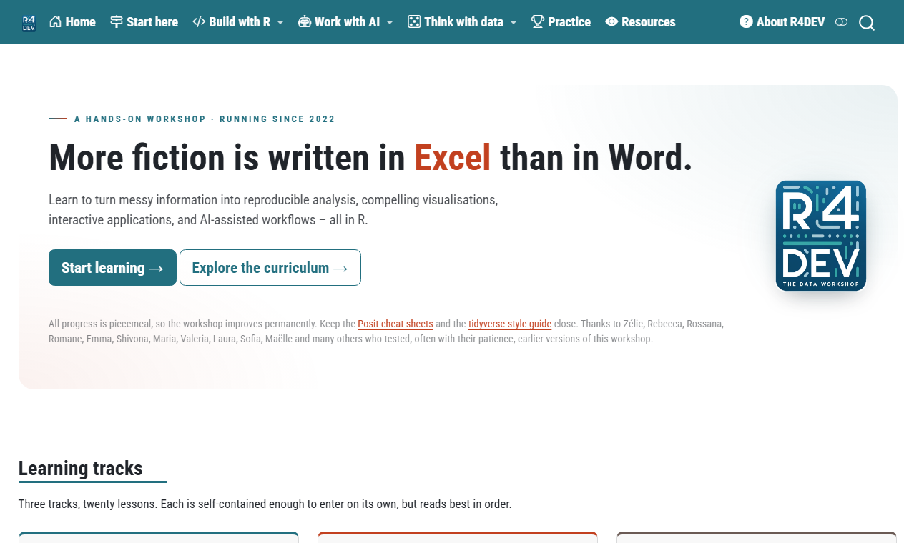

<div align="center">

<a href="https://nelsonamayad.github.io/R4DEV/"></a>

# R4DEV

**More fiction is written in Excel than in Word.**

A free, hands-on workshop on reproducible data analysis, visualisation, apps and AI workflows&nbsp;— all in R.

[](https://nelsonamayad.github.io/R4DEV/)
[](#the-curriculum)
[](https://quarto.org/)
[](https://cran.r-project.org/)
[](LICENSE)

**[Start learning →](https://nelsonamayad.github.io/R4DEV/start.html)** &nbsp;·&nbsp; [Curriculum](#the-curriculum) &nbsp;·&nbsp; [Practice](https://nelsonamayad.github.io/R4DEV/sessions_tools/01-practice/01-practice.html) &nbsp;·&nbsp; [Run it locally](#run-it-locally)

<br>

<a href="https://nelsonamayad.github.io/R4DEV/">
  <picture>
    <source media="(prefers-color-scheme: dark)" srcset=".github/assets/home-dark.png">
    
  </picture>
</a>

</div>

## What is R4DEV?

R4DEV grew out of training a constantly rotating team of analysts at the OECD, and has been running since 2022. Every lesson is built the same way: **download real data from the web, then build something you can look at**&nbsp;— a plot, a map, an animation, an app, a chatbot.

- **One page per lesson.** Read top to bottom and run the code as you go. Numbered annotations explain each line in context.
- **Practice at three levels.** Every lesson ends with Basic, Intermediate and Advanced exercises, so you can stop at the depth that suits you.
- **R in your browser.** Eleven pages run exercises live with [webR](https://docs.r-wasm.org/webr/latest/), with hints and solutions&nbsp;— nothing to install.
- **No API keys to read along.** LLM lessons show real captured output, so you only need a key when you run them yourself.
- **Live apps, not screenshots.** Shiny apps, interactive causal-inference explainers and a retrieval-augmented chatbot are embedded right in the lessons.

It is aimed at analysts, researchers, economists, policy professionals and students who already have a reason to work with data in R and want a practical, project-based way in. If you can open a file in RStudio or Positron and run a line of code, you can start lesson 1.

## The curriculum

Three tracks, twenty lessons. Each track stands on its own, but reads best in order.

### 🛠️ Build with R

Retrieve, transform, visualise, communicate and scale data workflows. [Track overview →](https://nelsonamayad.github.io/R4DEV/learn/build-with-r.html)

| # | Lesson | You will | Level · time |
|---|---|---|---|
| 1 | [Blogging with Quarto](https://nelsonamayad.github.io/R4DEV/sessions_workshop/01-quarto/01-quarto.html) | Write reproducible reports in Quarto and publish a live blog. | Beginner · 45 min |
| 2 | [Everything in its right place](https://nelsonamayad.github.io/R4DEV/sessions_workshop/02-plots/02-plots.html) | Pull real data from an API and build interactive charts with ggplot2, plotly and ggiraph. | Beginner · 90 min |
| 3 | [Data from words](https://nelsonamayad.github.io/R4DEV/sessions_workshop/03-text/03-text.html) | Turn raw text into tidy data, count it, and score its sentiment. | Intermediate · 60 min |
| 4 | [What books are about](https://nelsonamayad.github.io/R4DEV/sessions_workshop/04-topics/04-topics.html) | Let topic modelling stitch shuffled book chapters back together, and map ideas as a word network. | Intermediate · 45 min |
| 5 | [Making data move](https://nelsonamayad.github.io/R4DEV/sessions_workshop/05-animate/05-animate.html) | Turn a static plot into an animation that shows change over time. | Intermediate · 75 min |
| 6 | [Mapping despair in the USA](https://nelsonamayad.github.io/R4DEV/sessions_workshop/06-maps/06-maps.html) | Build static and interactive maps of real spatial data with ggplot2 and leaflet. | Intermediate · 90 min |
| 7 | [Just take it](https://nelsonamayad.github.io/R4DEV/sessions_workshop/07-scrap/07-scrap.html) | Scrape data directly from web pages when no API exists. | Intermediate · 60 min |
| 8 | [Make it shine](https://nelsonamayad.github.io/R4DEV/sessions_workshop/08-shiny/08-shiny.html) | Build an interactive Shiny app and deploy it to the web. | Advanced · 90 min |
| 9 | [Smart reports](https://nelsonamayad.github.io/R4DEV/sessions_workshop/09-reports/09-reports.html) | Generate a batch of parameterised reports from one template. | Intermediate · 45 min |
| 10 | [Do it well, do it fast](https://nelsonamayad.github.io/R4DEV/sessions_workshop/10-parallel/10-parallel.html) | Replace for-loops with purrr, then parallelise the same code with mirai. | Advanced · 45 min |

### 🤖 Work with AI

Use large language models as programmable tools for extraction, analysis, retrieval and app development. [Track overview →](https://nelsonamayad.github.io/R4DEV/learn/ai.html)

| # | Lesson | You will | Level · time |
|---|---|---|---|
| 1 | [Talking to machines](https://nelsonamayad.github.io/R4DEV/sessions_ai/01-llm/01-llm.html) | Call an LLM from R, extract structured data from text, and give the model callable tools. | Intermediate · 45 min |
| 2 | [Chat with your data](https://nelsonamayad.github.io/R4DEV/sessions_ai/02-llm-apps/02-llm-apps.html) | Embed a streaming chat UI and natural-language data filtering inside a Shiny app. | Intermediate · 45 min |
| 3 | [Grounded in truth](https://nelsonamayad.github.io/R4DEV/sessions_ai/03-ragnar/03-ragnar.html) | Build a full RAG pipeline: crawl, chunk, embed, store and retrieve real text for an LLM to answer from. | Advanced · 60 min |
| 4 | [Agentic coding](https://nelsonamayad.github.io/R4DEV/sessions_ai/04-agentic/04-agentic.html) | Understand what an agentic coding tool actually does under the hood, and the vocabulary around it. | Beginner · 45 min |

The track ends in a live capstone: **[Ask R4DEV](https://nelsonamayad.github.io/R4DEV/sessions_ai/03-ragnar/03-ragnar.html#capstone-ask-r4dev)**, a chatbot that answers questions about this workshop from the workshop itself, built with the same functions lesson 3 teaches.

### 🎲 Think with data

Reason clearly about uncertainty, inference, models, causality and Bayesian evidence&nbsp;— by simulation first, formulas second. [Track overview →](https://nelsonamayad.github.io/R4DEV/learn/thinking.html)

| # | Lesson | You will | Level · time |
|---|---|---|---|
| 1 | [Embrace the noise](https://nelsonamayad.github.io/R4DEV/sessions_thinking/01-uncertainty/01-uncertainty.html) | Simulate sampling variation to see the law of large numbers and the central limit theorem in action. | Beginner · 45 min |
| 2 | [There is only one test](https://nelsonamayad.github.io/R4DEV/sessions_thinking/02-inference/02-inference.html) | Run a hypothesis test by simulating a null world, first by hand, then with infer. | Intermediate · 45 min |
| 3 | [All models are wrong](https://nelsonamayad.github.io/R4DEV/sessions_thinking/03-regression/03-regression.html) | Fit, tidy and bootstrap a regression line, and learn where it breaks. | Intermediate · 45 min |
| 4 | [Draw your assumptions before drawing your conclusions](https://nelsonamayad.github.io/R4DEV/sessions_thinking/04-causal/04-causal.html) | Diagram causal assumptions with DAGs and see confounders and colliders bias an estimate. | Advanced · 45 min |
| 5 | [Earning the arrow](https://nelsonamayad.github.io/R4DEV/sessions_thinking/05-designs/05-designs.html) | See why randomisation works, how post-treatment controls break it, and break six research designs with a slider. | Advanced · 60 min |
| 6 | [Think Bayes](https://nelsonamayad.github.io/R4DEV/sessions_thinking/06-bayes/06-bayes.html) | Update a probability distribution one observation at a time, live in the browser. | Advanced · 60 min |

**Not sure where to begin?** [Start here](https://nelsonamayad.github.io/R4DEV/start.html) has prerequisites, an install checklist and suggested routes for newcomers, experienced R users and the AI-curious.

## Run it locally

You need [R](https://cran.r-project.org/) (4.6 or newer), [Quarto](https://quarto.org/docs/get-started/) (1.10 or newer) and an editor such as [RStudio](https://posit.co/download/rstudio-desktop/) or [Positron](https://positron.posit.co/).

```sh
git clone https://github.com/nelsonamayad/R4DEV.git
cd R4DEV
quarto preview        # live-reloading local copy of the site
```

That works straight away: the results of every lesson's code are cached in `_freeze/`, so previewing or rendering the site doesn't re-run any R until you edit a lesson. When you do, Quarto re-executes that lesson, so install the packages it names at the top, and expect it to download its data from the web.

- **Render one lesson:** `quarto render sessions_workshop/02-plots/02-plots.qmd`
- **Run a Shiny app:** `R -e 'shiny::runApp("shiny/r4dev-collider")'`. Every folder in `shiny/` is a standalone app.
- **API keys** go in your `.Renviron`, never in code. Only the maps lesson needs one to re-execute (a free [US Census key](https://api.census.gov/data/key_signup.html) as `CENSUS_API_KEY`); LLM lessons ship with captured output and never call a provider during a render.
- **Two lessons need local tools to re-execute:** *Grounded in truth* embeds text with a local [Ollama](https://ollama.com/) (`ollama pull embeddinggemma`, free, no key), and *Just take it* drives a headless Chrome through `chromote`.

## What's in the repository

```text
R4DEV/
├── index.qmd, start.qmd, about.qmd   homepage, "Start here", about
├── learn/                            one overview page per track
├── sessions_workshop/                Build with R: 10 lessons, one folder each (NN-name/NN-name.qmd + its data)
├── sessions_ai/                      Work with AI: 4 lessons
├── sessions_thinking/                Think with data: 6 lessons
├── sessions_tools/                   practice index, resources, feedback
├── shiny/                            the standalone Shiny apps embedded in the lessons
├── param_reports/                    separate Quarto project behind the "Smart reports" lesson
├── MyBlog/                           the demo blog students build in lesson 1
├── _freeze/                          cached code results (committed on purpose)
├── checks/                           link, image and alt-text checks; sitemap generator
├── _quarto.yml, _brand*.yml, style.css   site configuration, light/dark brand, custom CSS
└── _extensions/                      vendored Quarto extensions (webR, shinylive, lightbox…)
```

The site is built with `quarto render` into `_blog/` and published to GitHub Pages with `quarto publish gh-pages`.

## Feedback and contributions

Spotted a typo, a broken link, or a data source that has disappeared from the internet? Please [open an issue](https://github.com/nelsonamayad/R4DEV/issues). You can also annotate any page directly with the [Hypothesis](https://web.hypothes.is/) sidebar on the site, or tell me what worked and what didn't through the [feedback form](https://nelsonamayad.github.io/R4DEV/sessions_tools/03-feedback/03-feedback.html).

## License and citation

All content&nbsp;— lessons, code and data I created&nbsp;— is licensed under [Creative Commons Attribution 4.0 International](LICENSE) (CC BY 4.0): reuse it, adapt it, teach with it, and credit the source. Third-party datasets, images and libraries keep their own licences.

> Amaya, Nelson (2022–2026). *R4DEV: The data workshop.* https://nelsonamayad.github.io/R4DEV/

## Acknowledgements

All progress is piecemeal, so the workshop improves permanently. Thanks to Zélie, Rebecca, Rossana, Romane, Emma, Shivona, Maria, Valeria, Laura, Sofia, Maëlle and many others who tested, often with their patience, earlier versions of this workshop.

Built with [R](https://www.r-project.org/), [Quarto](https://quarto.org/), the [tidyverse](https://www.tidyverse.org/), [webR](https://docs.r-wasm.org/webr/latest/) and [Shiny](https://shiny.posit.co/), with apps hosted on [Posit Connect Cloud](https://connect.posit.cloud/).
