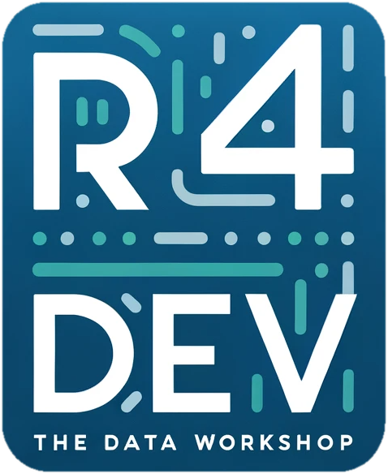

```{=html}
<style>
/* The masthead is the title of this page -- hide the auto-generated title header. */
#title-block-header { display: none; }
</style>
```

::: {.masthead}
::: {.masthead-content}
[A hands-on workshop · running since 2022]{.kicker}

[More fiction is written in [Excel]{.accent-word} than in Word.]{.masthead-title}

::: {.lede}
Learn to turn messy information into reproducible analysis, compelling visualisations, interactive applications, and AI-assisted workflows -- all in R.
:::

::: {.masthead-actions}
[Start learning →](start.qmd){.btn .btn-primary .btn-lg}
[Explore the curriculum →](#tracks){.btn .btn-outline-primary .btn-lg}
:::

[All progress is piecemeal, so the workshop improves permanently. Keep the [Posit cheat sheets](https://rstudio.github.io/cheatsheets/) and the [tidyverse style guide](https://style.tidyverse.org/) close. Thanks to Zélie, Rebecca, Rossana, Romane, Emma, Shivona, Maria, Valeria, Laura, Sofia, Maëlle and many others who tested, often with their patience, earlier versions of this workshop.]{.masthead-fineprint}
:::

::: {.masthead-visual}
```{=html}

```
:::
:::

## Learning tracks {#tracks .section-header}

Three tracks, eighteen lessons. Each is self-contained enough to enter on its own, but reads best in order.

```{=html}
<div class="track-grid">

<div class="track-card" data-track="build">
  <p class="track-card-title">Build with R</p>
  <p class="track-card-desc">Retrieve, transform, visualise, communicate, and scale data workflows with R.</p>
  <p class="track-card-meta"><span>9 lessons</span><span>Beginner → Advanced</span></p>
  <a class="btn btn-primary" href="learn/build-with-r.qmd">View track →</a>
</div>

<div class="track-card" data-track="ai">
  <p class="track-card-title">Work with AI</p>
  <p class="track-card-desc">Use large language models as programmable tools for extraction, analysis, retrieval, and application development.</p>
  <p class="track-card-meta"><span>4 lessons</span><span>Beginner → Advanced</span></p>
  <a class="btn btn-primary" href="learn/ai.qmd">View track →</a>
</div>

<div class="track-card" data-track="thinking">
  <p class="track-card-title">Think with data</p>
  <p class="track-card-desc">Reason clearly about uncertainty, inference, models, causality, and Bayesian evidence.</p>
  <p class="track-card-meta"><span>5 lessons</span><span>Beginner → Advanced</span></p>
  <a class="btn btn-primary" href="learn/thinking.qmd">View track →</a>
</div>

</div>
```

New to R4DEV? [Start here](start.qmd) for prerequisites, install steps, and a recommended route through the material.

### Build with R {.unnumbered}

::: {#build-with-r}
:::

### Work with AI {.unnumbered}

::: {#work-with-ai}
:::

### Think with data {.unnumbered}

::: {#think-with-data}
:::

## Resources {.section-header}

::: {#tools}
:::

::: {.resources-strip}
[Posit cheat sheets](https://rstudio.github.io/cheatsheets/)
[Tidyverse style guide](https://style.tidyverse.org/)
:::
