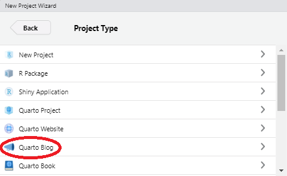
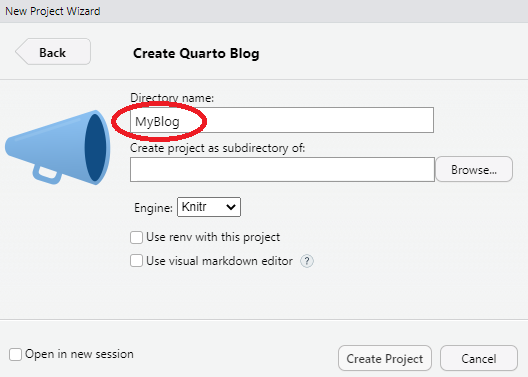
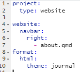
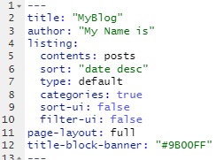
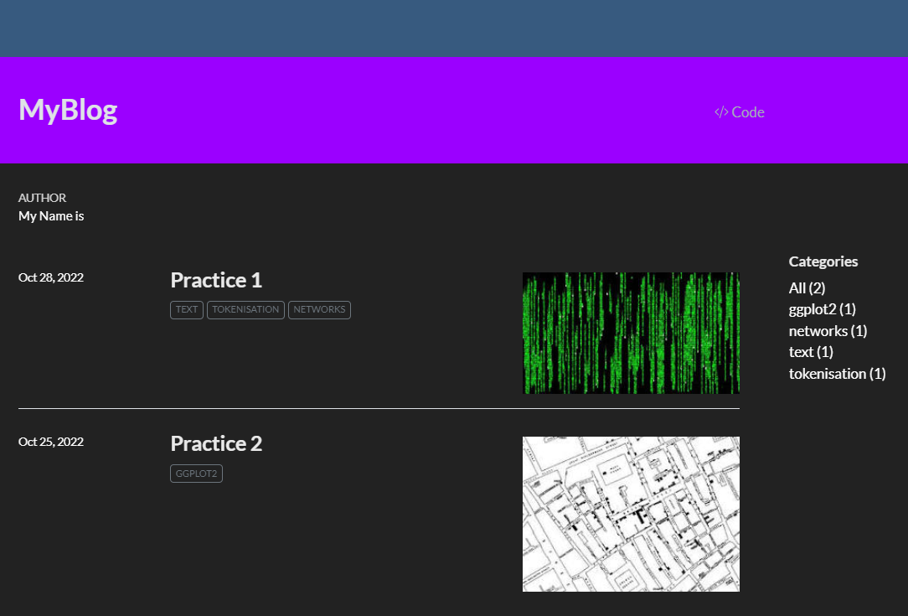

> "*[...] there is growing evidence documenting the prevalence of publication bias in economics and other scientific fields, as well as specification searching, and widespread inability to replicate empirical findings*." -- [Christensen & Miguel (2018)](https://www.aeaweb.org/articles?id=10.1257/jel.20171350)

In this first lesson you will build and publish a blog online for free using [Quarto](https://quarto.org/docs/reference/projects/websites.html) and [Netlify](https://www.netlify.com/).

::: {.lesson-info}
**Level:** Beginner &nbsp;·&nbsp; **Time:** ~45 min &nbsp;·&nbsp; **Prerequisites:** None &nbsp;·&nbsp; **Tools:** Quarto, RStudio, Netlify
:::

## You will learn to

- Tell a Quarto website apart from a Quarto blog, and pick the right one for a given project.
- Create a Quarto blog project in RStudio and preview it locally.
- Control site-wide configuration through `_quarto.yml`.
- Publish the rendered site online for free with Netlify.
- Annotate and discuss the published site with Hypothesis.

## Your blog online for free

You are lucky.

[Quarto](https://quarto.org/) is the publishing system this whole site is built with, and now you'll learn how to build one for yourself and publish it online for free. It goes beyond R -- it also handles [Python](https://www.python.org/), [Julia](https://juliacomputing.com/) and other languages -- and it keeps gaining new ways to publish content online.

A **Quarto website** and a **Quarto blog** are the same underlying project type, `type: website`, with one difference: a blog adds a `listing` on its home page that automatically shows your posts newest-first, with dates and images. If you don't need that -- say, a documentation site or a personal site with a handful of static pages -- a plain Quarto website skips the listing machinery entirely. This lesson builds a blog, since you'll be publishing dated practice posts throughout the workshop.

Let's build a blog-type website from scratch and publish it. Following every step below, including creating your Netlify and Hypothesis accounts, realistically takes 30-45 minutes the first time -- budget for that rather than the "five minutes" a bare render-and-deploy would take once everything is already set up.

::: callout-tip
## [**Netlify**](https://www.netlify.com/)

Quarto creates static sites, and you can deploy them online using [Netlify](https://www.netlify.com/), which is a professional platform for online content. Open a Netlify account and see how to deploy a site you create using Quarto [here](https://quarto.org/docs/publishing/netlify.html)
:::

### Step 1: Download and install Quarto, and create a Quarto Website Project from RStudio

[Open the Quarto get-started guide](https://quarto.org/docs/get-started/) to download Quarto and install it in your computer. Then open RStudio and create **New Project**. You see a few new options. Select **Quarto Blog**:

::: {#website-1 layout-ncol=2}

{#website-2}

Build the website as an RStudio Project
:::

### Step 2: YML the details and the face of the blog

By creating the website as a Quarto Blog project, a few files will be created automatically in the folder you chose. The most important files are the **`_quarto.yml`** file, which is the configuration file for the whole website (note the leading underscore -- a plain `quarto.yml` without it is not read by Quarto), and the **`index.qmd`**, which organises the default page of the blog.

In the **`_quarto.yml`** YML file you can include myriad options --from the title, logo, search box, header, footer, side bars, navigation bars, everything. In this file you will also format the output, which in this case is an HTML and you can include, just like in Shiny apps, Bootswatch themes, change fonts, colors, anything you want. This is also where the site's **`output-dir`** lives: it names the folder your render actually writes to (Quarto's own default is `_site`; this very R4DEV site sets it to `_blog`) -- check yours before deploying, since it's whatever folder you deploy, not a fixed name. Quarto is very versatile.

In the **`index.qmd`** file you basically design how the opening page of the blog will look like, what goes where and information on the author. The key option here is the [Listings](https://quarto.org/docs/websites/website-listings.html) so you can define how each blog post appears in the blog, and define the folder name where you will store all blog posts --conveniently called **posts**. You can add buttons to sort the posts or filter them.

::: {layout-ncol=2}
{#website-3}

{#website-4}

YML and index files in your blog
:::

::: callout-warning
## Careful with YML indentation!

Indentation order, and the space between options, is really important in YML documents.
:::

### Step 3: Build one blog post at a time

Notice that in the index Quarto document the listings include the folder **posts** that is already in your blog folder. Each entry of the blog should be a folder within posts with whatever you want to include, and the listings will include them in the opening page of the blog in the order you choose.

::: callout-tip
## Brilliant theming with [**`bslib`**](https://rstudio.github.io/bslib/)

One of the best customisation features for Quarto. With a few parameters you can completely change the look of a website, including colors, fonts and more. You can also use preexisting [bootswatch themes](https://bootswatch.com/)
:::

A Quarto document only shows up in the blog listing if it's covered by the listing's `contents` setting in `index.qmd` -- by default that's every subfolder of **posts**, which is why simply adding a new post folder there is enough, but nothing is included automatically just for existing somewhere in the project. In this case we'll create a post for every practice you'll do in this workshop.

### Step 4: Render to HTML

Now you can build your blog by opening the **`index.qmd`** document and clicking the "Render" button  or typing in the console **`quarto::quarto_render()`**. A new folder with all the HTML files and supporting configuration files will be built in the Quarto Blog project folder.

I've created two posts for each practice assignment from this workshop, added some images for each one, and here is the result:

{#website-5}

::: callout-tip
## Feedback: Annotate and Highlight R4DEV with Hypothesis

Commenting for the workshop is enabled using [**Hypothesis**](https://web.hypothes.is/start/). 

In the upper-right corner of each page there is a small menu you can click, and once you have registered with username-password, you can *Annotate*, *Highlight* or comment different parts of the site.  If you find errors, or things that need to be clarified, please signal them.
:::

### Step 5: Deploy to Netlify

There is more than one way to get a rendered site onto Netlify -- here is the simplest one, plus a better one for the long run.

**Option A -- manual drag-and-drop (simplest, good for a one-off).** Go to your new Netlify account, **"Add a new site"**, choose **"Deploy manually"**, and drag and drop the rendered output folder -- the one named by your project's `output-dir` (Step 2), `_site` by default -- where indicated. In a minute or so the blog should be live.

Change the website name in **"Site settings"** to something like [myblog-r4dev-practice.netlify.app](https://myblog-r4dev-practice.netlify.app) and voila.

::: callout-note
## Optional: Git-based automatic deployment

Manual drag-and-drop means re-uploading by hand every time you change the blog. If your project is on GitHub (or GitLab/Bitbucket), Netlify can instead watch that repository and rebuild the site automatically on every push: connect the repo from **"Add a new site" → "Import an existing project"**, and point the build settings at your `output-dir`. From then on, `git push` is your entire publishing workflow. The full walkthrough, including the `quarto publish netlify` command that does this from the command line, is in the [Quarto Netlify publishing guide](https://quarto.org/docs/publishing/netlify.html).
:::

::: callout-tip
## Quarto customisation

Bookmark the [Quarto Guide](https://quarto.org/docs/guide/) and [Quarto References](https://quarto.org/docs/reference/), you'll need them both.
:::

## 🏗 Practice 1: Create a Quarto blog {.unnumbered}

This is the first Practice. You'll have to publish all practice exercises for each session in your new blog.

::: {.callout-note icon="false" collapse="false"}
# Basic
- Create a free **[Netlify](https://www.netlify.com/)** account
- Create and publish your Quarto blog. The URL should be **http://r4dev-yourname.netlify.app**. In this blog you will publish all practice exercises
- Choose and apply the base [Bootswatch theme](https://bootswatch.com/) for your blog
- Enable [**Hypothesis**](https://web.hypothes.is/start/) commenting in your blog by adding `comments: hypothesis: true` in the YML (remember indentation!). Then create a group in Hypothesis with your name and share the link with me, so I can comment your site and provide suggestions.
- In your YML under the `html` option, include `code-tools: true`

Your YML file should look like this, in this case, using a Bootswatch theme called [journal](https://bootswatch.com/journal/):

- Customise the About page of your Quarto blog (Tip: [Check the About page in Quarto](https://quarto.org/docs/websites/website-about.html))
:::

## Key takeaways

- A Quarto **website** and a Quarto **blog** are the same engine with a different project template -- a blog just adds a listing page and post-dated entries by convention.
- `_quarto.yml` is where the whole site is configured: navigation, theme, output directory, and more.
- Whether a page shows up in a listing depends on the listing's own configuration, not on the page simply existing.
- Manual drag-and-drop to Netlify is the simplest way to publish, but it isn't the only one -- a Git-connected deploy updates automatically on every push.
- Hypothesis annotation turns any published page into a place for feedback and discussion.

::: {.continue-learning}
[Track overview: Build with R →](/learn/build-with-r.qmd)

[Next: Everything in its right place →](/sessions_workshop/02-plots/02-plots.qmd)
:::
