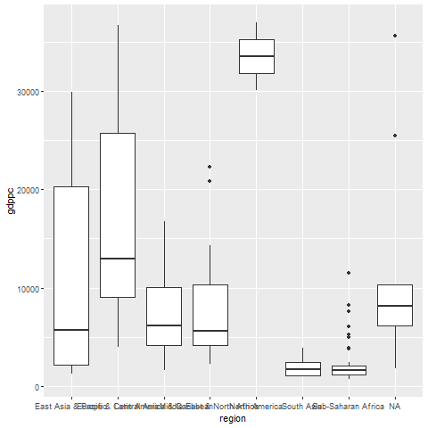
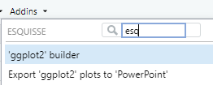

> "*Truth is much too complicated to allow anything but approximations.”*<br>--John von Neumann

## PART I: The story of a plot[^1]

[^1]: This section is based on this [excellent blog post](https://www.cedricscherer.com/2019/05/17/the-evolution-of-a-ggplot-ep.-1/#polish)

A good visualisation is never built in a single sitting. It always starts basic, inadequate, ugly even. It takes time to transform it into something worth any attention.

This session focuses on building plots using the **grammar of graphics** --how you can build any graph from three elements: 1) *data*, 2) a *coordinate system*, and 3) *visual marks* that represent each data point. This will serve as an introduction to **`ggplot2`**, which is a powerful visualisation package from the **`tidyverse`**.

To get us started, we'll tell a story of how to visualise cross-country comparisons of GDP per capita. The first chapter: importing the data into R.

::: callout-tip
## Tidy your data: How your data should look like


:::

### Import the [Maddison Project](https://www.rug.nl/ggdc/historicaldevelopment/maddison/) data from [OWID GitHub](https://github.com/owid)

To begin, we look for the data we need. The Maddison Project has data in Excel and Stata to download (see [here](https://www.rug.nl/ggdc/historicaldevelopment/maddison/releases/maddison-project-database-2020)), but there is a better way to get it. Accessing OWID's repository is two clicks away from Google, and when we find the data we want, we copy the URL that leads us directly to the raw data. Using the `read_csv()` function, we can easily import the data into R.

One thing you'll notice about the data is that it only has country names. No regions, continents, of other geographical aggregates.

We'll use the incredibly handy **`countrycodes`** package to add regions and country ISO3 codes, which is a convention that will save you a lot of time and headaches from country names spelled differently, or in other languages. We'll also use the `clean_names()` function from the **`janitor`** package to handle the long and capitalized names of the variables in the data easily.

::: callout-tip
## The end of inconsistent contry names/codes: **`countrycodes`**

Country names and codes are a headache. They often come in different naming conventions, different spelling or special characters. **`countrycodes`** package solves the problem by looking in a huge library of spellings and coding conventions, so you can have retrieve the names or codes for countries and regions as needed.
:::

### Take 1: A first, very ugly, graph

With the data downloaded into R, and the country regions and codes added to it, we can make our first plot. We filter the data for the year 1990 and feed it to **`ggplot`**. Given that reach region has multiple countries, we'd like to plot the distribution of GDP per capita within each region. There are many geometries in **`ggplot`** that accomplish this, so we'll use the simplest one `geom_boxplot()`.

Notice that within ggplot we don't use the pipe anymore: to add options, we use the **`+`** operator.

```{r 2.maddison-data}
#| fig-cap: "A first, ugly, plot"

library(tidyverse)
library(countrycode) 
library(janitor)

# Data ####
owid_maddison_proj <- readr::read_csv("https://raw.githubusercontent.com/owid/owid-datasets/master/datasets/Maddison%20Project%20Database%202020%20(Bolt%20and%20van%20Zanden%20(2020))/Maddison%20Project%20Database%202020%20(Bolt%20and%20van%20Zanden%20(2020)).csv") # <1>

owid_maddison_proj_df <- owid_maddison_proj |> # <2>
  janitor::clean_names() |> # <3>
  dplyr::rename(country=1,gdppc=3) |> # <3>
  dplyr::mutate(iso3c = countrycode::countrycode(sourcevar = country, origin = "country.name", destination = "iso3c"), # <4>
                region = countrycode::countrycode(sourcevar = country, origin = "country.name", destination = "region")) # <4>

# A first visual ####
maddison_proj_1 <- owid_maddison_proj_df |>
  dplyr::filter(year==1990) |> # <5>
  ggplot(aes(x=region,y=gdppc))+ # <6> 
  geom_boxplot() # <7>

# Display graph 
maddison_proj_1 # <8> 

```

1.  OWID repository for the Maddison Project data
2.  Start with the raw data and save to a new data frame
3.  We clean the variable names using the `clean_names()` function and shorten even further the GDP per capita variable name using `rename()`
4.  Add country 3-digit ISO code and region using the `countrycodes()` function
5.  Filter for year 1990
6.  Pipe data into ggplot and define X and Y axis
7.  Show a boxplot
8.  Let's send the result to the console to see it

::: callout-tip
## Learn to love the pipe

The pipe **`|>`** or **`%>%`** lets you sequentially chain many operations together and avoid "Russian doll" coding, where you put operations within operations and get quickly get lost on which parenthesis closes which operation.

The pipe is very simple: **`x |> f(y)`** is equivalent to **`f(x,y)`**. Learn to love it.
:::

::: column-margin

:::

This plot already tells us a few things. First, some regions have more variability than others because they have more countries. North America is composed of three countries only, and the box plot doesn't do a good job in showing the differences. Perhaps we want a continent variable instead of region.

We can also see that the labels overlap and are hard to read, the labels of the axis are not super clear, we have an NA region, and the graph lacks a title and a source. We have a lot of work ahead.

### Take 2: Reorder, log, remove defaults

We'll change the aggregate axis from region to continent using `countrycode()` again and remove subregion aggregates, filtering all empty values of the continent variable using the `filter()` function and the `is.na()` function preceded by `*!*` operator, which does the inverse of any function (as in !x = not x).

Then we create an ordering variable to sort the continents from higher to lower median GDP per capita levels using `group_by()` and `mutate()`. We can then reorder our continent variable using this newly-created median by factoring the variable and using this median to order it with `fct_reorder()`. As we are dealing with a wide range of GDP per capita levels, we can also change the scale of the axis to a logarithmic scale using `scale_x_log10()`.

By default, the plot includes a grey background and other features we can do without. We use a theme that cleans the plot from background colors and other features that **`ggplot`** uses by default. The clean theme we use is `theme_classic()`, which makes the plot more focused in the information being conveyed.

We do all this in the same pipe we built before, and this is the result:

```{r 2.maddison-2}
#| fig-cap: "A second, clearer, plot"

library(tidyverse)
library(countrycode) 

# Data ####
owid_maddison_proj_df2 <- owid_maddison_proj_df |> # <9>
  dplyr::mutate(continent = countrycode::countrycode(sourcevar = iso3c, origin = "iso3c", destination = "continent")) # <10>

# New attempt ####
maddison_proj_2 <- owid_maddison_proj_df2 |>
  dplyr::filter(year==1990, !is.na(continent)) |> # <11>
  dplyr::group_by(continent) |> # <12>
  dplyr::mutate(m_gdppc = median(gdppc, na.rm=TRUE)) |> # <13>
  dplyr::ungroup() |> # <14>
  dplyr::mutate(continent = fct_reorder(continent, m_gdppc)) |> # <15>
  ggplot(aes(x=continent,y=gdppc))+ # <16>
  geom_boxplot()+ # <17> 
  scale_y_log10()+ # <18> 
  theme_classic()+ # <19>
  theme(legend.position = "none") # <20> 

# See the result ####
maddison_proj_2

```

9.  We save a new data frame with the continent option
10. Add continent variable
11. Filter for the year we want and drop countries with no continent matched using !`is.na()`
12. Group the data by continent
13. Create a new variable with the median of GDP per capita in each continent
14. Return to all data by ungrouping
15. Reorder the variable using factors
16. Pipe into ggplot and define X and Y axis
17. Show a boxplot
18. Display the axis in log scale
19. Use a theme that cleans the background
20. We suppress the legend everywhere with this option

::: callout-warning
## Keep your raw data free from your own mistakes

***Creating Data*** and ***Modifying Data*** are totally different processes. Follow the seemingly trivial rule of never modifying your raw data to avoid making really ***big mistakes*** in your data workflow that can seriously undermine any project. <br> Always create new objects based on the raw data instead of overwriting it.
:::

### Take 3: Re-scale axis

We can improve the figure by transforming the X axis to logarithm using `scale_x_log10()`:

```{r 2.maddison-3}
#| fig-cap: "A third, better, plot"

library(tidyverse)
library(RColorBrewer)

# A third visual ####
maddison_proj_3 <- owid_maddison_proj_df2 |>
  dplyr::filter(year==1990, !is.na(continent)) |> 
  dplyr::group_by(continent) |>
  dplyr::mutate(m_gdppc = median(gdppc, na.rm=TRUE)) |>
  dplyr::ungroup() |>
  dplyr::mutate(continent = fct_reorder(continent, m_gdppc)) |>
  ggplot(aes(y=continent,x=gdppc, color=continent))+
  geom_boxplot(outlier.alpha= 0.5)+
  scale_x_log10()+
  theme_classic()+
  theme(legend.position = "none")

maddison_proj_3

```

### Take 4: Add flair

Now we add points for each data point around the boxplot using `geom_jitter()`, which adds random noise to each point so they don't overlap. We'll include a shape option to give a different shape to the points of each continent.We also use the **`RColorBrewer`** package to set a nicer color palette for each continent, and change the intensity of the color of outlier points using the outlier.alpha option within the geom.

```{r 2.maddison-4}
#| fig-cap: "A forth attempt, adding more features"

library(tidyverse)
library(RColorBrewer)

# A forth visual ####
maddison_proj_4 <- owid_maddison_proj_df2 |>
  dplyr::filter(year==1990, !is.na(continent)) |>
  dplyr::group_by(continent) |>
  dplyr::mutate(m_gdppc = median(gdppc, na.rm=TRUE)) |>
  dplyr::ungroup() |>
  dplyr::mutate(continent = fct_reorder(continent, m_gdppc)) |>
  ggplot(aes(y=continent,x=gdppc, color=continent))+
  geom_boxplot(outlier.alpha= 0.5)+ # <21>
  geom_jitter(aes(shape=continent), alpha=0.4)+ # <22>
  scale_color_brewer(palette="Set1")+ # <23>
  scale_x_log10()+
  theme_classic()+
  theme(legend.position = "none")

maddison_proj_4

```

21. Make the outliers lighter
22. Show jittered points colored by continent, with random noise so they don't overlap
23. Set a color palette for continents

### Take 5: Doing labels right

Finally we add labels, titles and subtitles. We also will create floating labels for one country in each continent: China, Mexico, Australia, France and Nigeria, which we filter within the geom. Notice how the data is filtered for only this text geom. We use the **`.`** operator, which is used to work from whatever data comes down the pipe, and then we filter the three countries we want to label.

We use **`ggrepel`** package for this.The `geom_label_repel()` will make sure the labels don't overlap by, as the name suggests, repelling them from one another. We add the option `position_jitter()` so that the labels match the points with random noise that we had included when using `geom_point()` using the same positioning.

We also replace the scaling of the Y axis to something more flexible, using `scale_y_continuous()` and adding a few things to it: the breaks option, so the labels shown make more sense for this scaling, and number formatting using `number_format()`.

::: callout-tip
## How do I handle long labels? Use **`scales`**

Sometimes you have very long or uneven text in an axis or legend, which makes the plot look terrible. Using the **`scales`** package, you can fix this by wrapping the label by a desired number of characters. Use the `label = scales::label_wrap()` option when labeling text to break across lines.
:::

```{r 2.maddison-5}
#| fig-cap: "A fifth version"

library(tidyverse)
library(ggrepel)
library(RColorBrewer)

# A fifth visual ####
maddison_proj_5 <- owid_maddison_proj_df2 |>
  dplyr::filter(year==1990, !is.na(continent)) |>
  dplyr::group_by(continent) |>
  dplyr::mutate(m_gdppc = median(gdppc, na.rm=TRUE)) |>
  dplyr::ungroup() |>
  dplyr::mutate(continent = fct_reorder(continent, m_gdppc)) |>
  ggplot(aes(y=continent,x=gdppc, color=continent))+
  geom_boxplot(outlier.alpha= 0.5)+
  geom_point(aes(shape=continent), alpha=0.4, position = position_jitter(seed = 1))+
  ggrepel::geom_label_repel(data = . %>% # <24>
                    dplyr::filter(country %in% c("Mexico","China","Nigeria","France","Australia")), # <25>
                    aes(label=country), # <25>
                    size=3, color="black", # <26>
                    position = position_jitter(seed = 1)  # <27>
                    )+ 
  scale_x_continuous(trans = "log10", labels = scales::number_format(big.mark=" "))+ # <28>
  scale_color_brewer(palette="Set1")+
  labs(y = NULL, x = "GDP per capita", # <29>
       title = "Maddison Project - GDP per capita in 1990", # <29>
       subtitle = "GDP per capita", # <29>
       caption = "Source: Own calculations based on Maddison Project and OWID GitHub")+ # <29>
  theme_classic()+
  theme(legend.position = "none", # <30>
        axis.text.y = element_text(size = 14) # <30>
  )

# Display plot ####
maddison_proj_5

```

24. You can control the data that goes into each layer of ggplot2. The `.` operator stands for whatever data is in the `ggplot()` function at the top of the pipe, and you can pipe in more operations that apply only to this layer.
25. Filter Mexico, China, Nigeria and 1990 only for this geom.
26. Add an `arrow()`.
27. Notice we add `position` to align the labels with the jittering.
28. Improve the log scale display using breaks and space between thousands digits using `number_format()`
29. Add multiple labels to the plot: title, subtitle, caption
30. Increase size of continent axis label and drop the legend

### Take 6: Facets

The final graph is going to take advantage of the fact that we have data for all countries for multiple years, and we can compare two moments in time instead of sticking with one cross section. So let's compare 1990 to 2015 using faceting.

Faceting is a way to create multiple plots that share the same structure and axes but show different parts of data. You can use the `facet_wrap()` or `facet_grid()` to create faceted plots and break down your data into smaller, more manageable groups, and visualize them separately.

`facet_wrap()` is used when you want to create a single row or column of plots, where each plot represents a different part of your data. You specify the variable to facet on using the `~` symbol, and the number of columns or rows you want using the `ncol` or `nrow` arguments. We use `nrow=2` so the two graphs, for 1990 and 2015, appear one on top of the other.

```{r 2.maddison-6}
#| fig-cap: "A new version, with faceting"
library(tidyverse)
library(ggrepel)
library(RColorBrewer)

# New version with facets ####
maddison_proj_6 <- owid_maddison_proj_df2 |>
  dplyr::filter(year %in% c(1990,2015), !is.na(continent)) |>
  dplyr::group_by(year, continent) |>
  dplyr::mutate(m_gdppc = median(gdppc, na.rm=TRUE)) |>
  dplyr::ungroup() |>
  dplyr::mutate(continent = fct_reorder(continent, m_gdppc)) |>
  ggplot(aes(y=continent,x=gdppc, color=continent))+
  geom_boxplot(outlier.alpha= 0.5)+
  geom_point(aes(shape=continent), alpha=0.4, position = position_jitter(seed = 1))+
  ggrepel::geom_label_repel(data = . %>%  
                    dplyr::filter(country %in% c("Mexico","China","Nigeria","France","Australia")),
                    aes(label=country), size=3, color="black", 
                    arrow = arrow(type = "closed"),
                    position = position_jitter(seed = 1))+
  scale_x_continuous(trans = "log10",labels = scales::number_format(big.mark=" "))+
  scale_color_brewer(palette="Set1")+
  facet_wrap(~year, nrow=2)+ # <31>
  labs(x = NULL, y = "GDP per capita",
       title = "Maddison Project - GDP per capita in 1990 vs 2015",
       subtitle = "GDP per capita",
       caption = "Source: Own calculations based on Maddison Project and OWID GitHub") + 
  theme_classic()+
  theme(legend.position = "none",
        axis.text.y = element_text(size = 14)
  )

# Display plot ####
maddison_proj_6

```

31. Faceting means splitting the graph into multiple parts based on one or multiple variables

### Final take: Themes

The final transformation involves themes. They are an essential part of the grammar, helping you control the non-data parts of their plots, such as titles, labels, fonts, background, grid lines, and more. The list is [loooong](https://ggplot2.tidyverse.org/reference/ggtheme.html). The idea is to make it easy to modify the appearance of plots without changing the underlying data or the type of plot.

We will use another package [`hrbrthemes`](https://github.com/hrbrmstr/hrbrthemes) to finish our plot. Notice that I just add a new layer to the earlier figure. We use the `theme_ipsum_rc()` function and this is the result:

```{r 2.maddison-7}
#| fig-cap: "A final version, with a predfined theme"
library(tidyverse)
library(ggrepel)
library(RColorBrewer)
library(hrbrthemes)

# A final visual ####
maddison_proj_7 <- maddison_proj_6 +
  hrbrthemes::theme_ipsum_rc()+
  theme(legend.position = "none",
        axis.text.y = element_text(size = 12)
  )
  
# Display plot ####
maddison_proj_7
```

### Before and after

The plot is not yet ready for publication; there are other improvements we could do.

But let's compare where we started and where we are now:

{#fig-maddison}

```{r}
#| eval: false
#| include: false

library(animation)
animation::saveGIF(
  expr = {
    plot(maddison_proj_1)
    plot(maddison_proj_2)
    plot(maddison_proj_3)
    plot(maddison_proj_4)
    plot(maddison_proj_5)
    plot(maddison_proj_6)
    plot(maddison_proj_7)
    },
  movie.name = paste0(getwd(),"/sessions/02-plots","/maddison_proj.gif")
)

```

## PART II: Feel the music:  Spotify {.unnumbered}

Thanks to Spotify API, we can access a wealth of data on artists, songs, etc. APIs are front doors to access databases online, and they are a wonderful resource. To access Spotify's API, we need to have an account and ask permission. You can go to the [developer login](https://developer.spotify.com/dashboard/login) and request one. You will receive a **client ID** and a **client secret** code that will connect your computer to the API to make requests for data.

We will use the [`spotifyr`](https://github.com/charlie86/spotifyr) package to download the info. The data usually needs an artist ID to retrieve information, so we build a quick function to extract the name of the artist we need so we can download the data we want. We then get the data for **Radiohead**. Why? I love Radiohead.

Let's start with the music, downloading all the discography.

::: callout-note
## Get your own Spotify tokens!

Create and use your own Spotifyr token and secret code in the [developer page](https://developer.spotify.com/dashboard/login)
:::

```{r 2.spotifyr-ids}
#| include: false
my_spotify_id <- "REDACTED_SPOTIFY_CLIENT_ID"
my_spotify_secret <- "REDACTED_SPOTIFY_CLIENT_SECRET"
```

```{r 2.spotifyr}

library(tidyverse)
library(spotifyr)

# Set Client ID and Client Secret - Use your own ! ####
Sys.setenv(SPOTIFY_CLIENT_ID = my_spotify_id)   # <32>
Sys.setenv(SPOTIFY_CLIENT_SECRET = my_spotify_secret) # <32>

# Save access token ####
spotify_access_token <- get_spotify_access_token() # <33>

# Get artist ID based on name ####
spotify_id <- function(artist_name) {   # <34>
  
spotifyr::search_spotify(print(artist_name), type = "artist") |>  # <34>
  dplyr::arrange(desc(popularity)) |> # <34>  
  dplyr::select(id) |>  # <34>
  dplyr::slice(1) |>   # <34>
  as.character()   # <34>
   
} # <34>

# using the function we can identify the ID for Radiohead 
spotify_id("Radiohead")  # <35>

# Download all discography for Radiohead ####
radiohead_spotify <- spotifyr::get_artist_audio_features(  # <36>
  artist = "4Z8W4fKeB5YxbusRsdQVPb",  # <36>
  include_groups = "album", # <36>
  authorization = spotify_access_token # <36>
  )

```

32. You need to replace `my_spotify_id` and `my_spotify_secret` with your own tokens
33. Save your token to your environment so you can use it later
34. Learn to create your own functions. Functions take user-defined inputs and produce outputs. In this case, our function takes the name of an artists and returns the Spotify artist ID for the closest match.
35. We use our function to look for the ID of Radiohead
36. We use the `get_artist_audio_features()` function to download all data related to Radiohead's songs. First, we use the artist_id. Then we use an option to download all albums and, finally, we provide our API key ---the token we need to use to access the data.

### Dance Thom, dance!

Now let's compare some musical features of Radiohead's studio albums. We will plot *valence*, *tempo*, *energy* and *danceability*.

-   **Danceability**: describes how suitable a track is for dancing based on a combination of musical elements including tempo, rhythm stability, beat strength, and overall regularity. A value of 0 is least danceable and 1 is most danceable.

::: column-margin

:::

-   **Energy**: a measure from 0 to 1 and represents a perceptual measure of *intensity* and activity. Typically, energetic tracks feel fast, loud, and noisy. For example, death metal has high energy, while a Bach prelude scores low on the scale. Perceptual features contributing to this attribute include dynamic range, perceived loudness, timbre, onset rate, and general entropy.

-   **Tempo**: estimated tempo of a track in beats per minute (BPM). In musical terminology, tempo is the speed or pace of a given piece and derives directly from the average beat duration.

-   **Valence**: a measure from 0 to 1 describing the musical *positiveness* conveyed by a track. Tracks with high valence sound more positive (e.g. happy, cheerful, euphoric), while tracks with low valence sound more negative (e.g. sad, depressed, angry).

Looking at the density of each variable for every album, we can see that *A Moon Shaped Pool*, their latest album and most mellow-sounding one, has the least energy, while *The King of Limbs*, which include the awesome track *Lotus Flower*, is the most energetic one.

```{r 2.radiohead}
#| out-width: "100%"
#| fig-cap: "Dance Thom, dance!"
 
library(ggridges) # Overlaying density plots, perfect for probabilistic inference
library(RColorBrewer) 

radiohead_spotify |>  # <37>
  dplyr::filter(album_name %in% c("Pablo Honey","The Bends","OK Computer","Kid A","Amnesiac","Hail To the Thief","In Rainbows","The King Of Limbs","A Moon Shaped Pool")) %>% # <38>
  tidyr::pivot_longer(cols = c("valence","tempo","danceability","energy"), names_to = "metric") |> # <39>
  ggplot(aes(x = value, y = album_name, fill=factor(metric))) + # <40>
    geom_density_ridges(show.legend = FALSE) + # <41>
    theme_ridges() +
    labs(title = "Radiohead - Musical features of studio albums", # <42>
         subtitle = "Based on Spotify's Web API with spotifyr",  # <42>
         y=NULL,  # <42>
         x=NULL)+  # <42>
    facet_wrap(~metric, scales = "free_x", nrow = 2)+ # <43>
    scale_fill_manual(values = c("gold2","orangered2","royalblue2","forestgreen")) # <44>

```

37. We start with the data
38. We filter the studio albums using the *x `%in%` y* operator, which stands for `x is a subset of y`.
39. Do you remember endlessly Googling *`reshape`* in Stata? No more. We pivot the data such that each of the chose variables goes from a column to a row.
40. We pipe in the data into `ggplot` and define the aesthetics: what goes where.
41. With the `ggridges` package we use a better geometry for the data, overlaping density plots. We use the option `show.legend=FALSE`.
42. We add some labels to the plot
43. Remember faceting? Now we make use of the pivot longer form to make 4 facets of the plot in 2 rows
44. We apply a manual color scale, such that each variable has a color

::: callout-tip
## Pivoting with **`tidyr`**, or the joy of never having to Google reshape again

Pivoting with `tidyr` involves transforming data from a long format to a wide format, and vice versa.

The `pivot_longer()` function helps you convert data from a wide format to a long format by stacking multiple columns into a single column while preserving the relationship between variables. You specify `cols = c(A, B)` to indicate which columns should be transformed into a single variable column, and `names_to = "variable"` and `values_to = "value"` to specify the names of the resulting columns.

The `pivot_wider()` function allows you to spread values across new columns based on a specified variable. You specify `names_from = variable` to indicate that the variable column should be used as the column names in the resulting wide data frame, and `values_from = value` to indicate that the value column contains the data to be spread across the columns.
:::

::: column-margin

:::

### Comparing musical tastes {.unnumbered}

Let's have some fun with the Spotify data.

Below we'll compare a metric for some artists, our favorites. It takes a while for the code to run, so be patient.

```{r 2.tastes}

library(tidyverse)

favorites <- tribble( # <45>
  ~name,~artist, # <45>
  "zelie","The Strokes",
  "romane","Ben Howard", # <45>
  "nelson","Foals", # <45>
  "rossana","Imagine Dragons", # <45>
  "emma","Paolo Nutini", # <45>
  "shivona","Milky Chance", # <45>
  "valeria","Florence + The Machine", # <45>
  "maelle","Michael Kiwanuka" # <45>
  ) |> # <45> 
  dplyr::rowwise() |> # <45> 
  dplyr::mutate(artist_id = spotify_id(artist)) # <45>

# Now we can save all discographies into a list by using a loop ####
favorites_music <- list() # <46>

# Now we loop, or boucle if you're French ####
for(i in favorites$artist_id) { # <47>
  
  favorites_music[[i]] <- spotifyr::get_artist_audio_features(
    artist = print(i), # <47>
    include_groups = "album", # <47>
    authorization =  spotify_access_token) # <47>

} # <47>
```

45. We create a list of favorites artists using `tribble`, a function we can use to manually create rectangular databases on the fly. First row uses the `~` operator to name variables and the rest are the values of each observation. We use `rowwise` to make an operation along each row, and create a new variable that holds the artist ID by using the function we created above.
46. First we create an empty list where we will store the data
47. Now we run a for loop over our favorite artist `tribble()` that will save each discography as an element of our list.

::: column-margin
::: callout-tip
## Tibble? Tribble? What is the difference?

- **`tibble`**: Using the `tibble()` function, you can create a new data frame from vectors. Each argument to `tibble()` becomes a column in the tibble, and you can use it to quickly assemble data frames without having to transpose or reshape the data.

- **`tribble`**: Using the `tribble()` function, which stands for *transposed tibble*, you can easily do manual entry of data. The syntax of `tribble()` is useful for creating small data frames in a readable way, and involves specifying the column headers followed by the values row by row. For example, `tribble(~x, ~y, 1, "a", 2, "b")` creates a tibble with 2 columns (x, y) and 2 observations (x = c(1,2), y = c("a","b")).
:::
::: 

Now let's compare the songs of these artists in a Energy/Valence scale inspired by this [Sentify Shiny app](http://rcharlie.net/sentify/). We will improve our aesthetics by using a color palette inspired by a [great work of art in the Metropolitan Museum of Art in New York](https://github.com/BlakeRMills/MetBrewer).

```{r 2.favorites-2}

library(tidyverse)
library(MetBrewer) # MET color palettes

favorites_music |> # <48>
  purrr::map_df(bind_rows) |> # <49>
  dplyr::left_join(favorites, by="artist_id") |> # <49>
  ggplot(aes(y=energy,x=valence,color=artist_name))+ # <50>
  geom_point(aes(shape=artist_name))+ # <51>
  geom_hline(yintercept = 0.5)+ # <52>
  geom_vline(xintercept = 0.5)+ # <52>
  annotate("text", x = 0.1, y = 1, label = "Turbulent/Angry")+ # <53>
  annotate("text", x = 0.8, y = 1, label = "Happy/Joyful")+ # <53>
  annotate("text", x = 0.1, y = 0.1, label = "Sad/Depressing")+ # <53>
  annotate("text", x = 0.8, y = 0.11, label = "Chill/Peaceful")+ # <53>
  MetBrewer::scale_color_met_d(name = "Ingres")+ # <54>
  scale_shape_manual(values = c(1:8))+  # <55>
  theme_classic()+  # <56>
  theme(legend.position = "top", # <57>
        legend.title = element_blank()) # <58>
```

48. Now we run a for loop over our favorite artist tribble that will save each discography as an element of our list.
49. Now we put all discographies together using `map` function, which binds all rows from each discography together in a dataframe. We then merge/join the data using `left_join()`.
50. Pipe in the data into `ggplot`
51. Create a first geometry and vary the point by artist using `shape`
52. Add some lines to create 4 quadrants
53. Include the name of each quadrant using `annotate`
54. Use a color palette from the `MetBrewer` package. We pick Ingres.
55. Specify the shapes of points manually
56. Use a theme that cleans the plot from noisy background
57. Position the legend at the top of the figure
58. Eliminate the title of the legend.

### We're missing out, let's make this interactive with [Plotly](https://plotly.com/r/) {.unnumbered}

With a single step we can make this plot interactive using the **`plotly`** library. Plotly is an incredibly powerful visualisation tool, but it has a different syntax from ggplot, so be careful not to confuse one with the other.

We can turn a **`ggplot2`** figure into an interactive plot easily using the `ggplotly()` function. Look at the trick in the `geom_point()` function to make the tooltip work well.

Plotly wraps well around ggplot, and gives additional funcionalities with very little additional coding.

```{r 2.plotly}

library(plotly)
library(tidyverse)
library(MetBrewer)

favorites_plot <- favorites_music %>%
  purrr::map_df(bind_rows) %>%
  dplyr::left_join(favorites, by="artist_id") |> # <49>
  ggplot(aes(y=energy,x=valence,color=artist_name))+
  geom_point(aes(shape=artist_name,
    text = paste('Artist: ', artist_name, # <59> 
                 '<br>Song:', track_name, # <59> 
                 '<br>Album:',album_name)),  # <59> 
             position = "jitter")+
  geom_hline(yintercept = 0.5)+
  geom_vline(xintercept = 0.5)+
  MetBrewer::scale_color_met_d(name = "Ingres")+
  scale_shape_manual(values = c(1:8))+
  theme_classic()+
  theme(legend.position = "top",
        legend.title = element_blank())

plotly::ggplotly(favorites_plot, tooltip = "text") # <60> 

```

59. Create tooltip information for `ggplotly`. <br> is new line in HTML.
60. Use `ggplotly` on a `ggplot` figure to transform it to an interactive plot.

::: callout-tip
## Want to create a plot interactively? Use [**`esquisse`**](https://cran.r-project.org/web/packages/esquisse/vignettes/get-started.html)

**`esquisse`** is a package that allows you to create and edit a plot using point-click. It will appear as an Add-in like shown below or you can launch it in the console using `esquisser()`.


:::

## Bonus track: Better interactivity with [girafe](http://davidgohel.github.io/ggiraph/){.unnumbered} 

### Using 🦒 in the Maddison Project data

We can create multiple graphs that interact with each other using the **`ggiraph`** package.

We'll add time to the first plot we made in this session. First, we will create two visualisations that will be connected to one another: a line that tracks GDP per capita through time, and a distributional plot like the latest version of the plot above.

We create each one separately using the extended geoms that the **`ggiraph`** package includes, which has the option `_interactive` at the end of geoms we already know. So we'll use `geom_point_interactive()` for the line plot and `geom_boxplot_interactive()` for the distributional plot, and connect them to each other with the **data_id** and **tooltip** options.

We can then add both plots (literally, add them using the **`patchwork`** package) inside of `girafe()` in the `ggobj` option. Using the function `plot_annotation()` we can add title, subtitle and caption in a way that applies to both plots.

The result is two graphs that interact through the **data_id** and **tooltip** aesthetics.

What did we accomplish here? Simple: not overloading information into a single graph.

```{r 2.maddison-ggiraph}
#| column: screen-inset-right

library(tidyverse)
library(RColorBrewer)
library(ggiraph)       # To create interactive plots
library(patchwork)     # To add plots together

# GDP per capita through time by continent ####
maddison_time <- owid_maddison_proj_df2 |>
  dplyr::filter(year>=1950,!is.na(continent)) |>
  dplyr::group_by(year, continent) |> # <61>
  dplyr::summarise(m_gdppc = median(gdppc, na.rm=TRUE)) |> # <62>
  ggplot(aes(x=year,y=m_gdppc, color=continent))+
  geom_path_interactive(aes(data_id=continent, tooltip=continent))+  # <63>
  scale_x_log10()+
  scale_color_brewer(palette="Set1")+
  labs(x = NULL, y = "GDP per capita") + 
  theme_classic()+
  theme(legend.position = "none")

# Distribution of GDP per capita by continent  ####
maddison_continent <- owid_maddison_proj_df2 |>
  dplyr::filter(year>=1950,!is.na(continent)) |>
  ggplot(aes(y=continent,x=gdppc, color=continent, fill=continent))+
  geom_jitter(color="grey90")+ # <64>
  geom_violin(alpha=0.4)+ # <64>
  geom_boxplot_interactive(aes(data_id=continent, tooltip=continent))+ # <65>
  scale_x_continuous(trans = "log10",labels = scales::number_format(big.mark=" "))+
  scale_fill_brewer(palette="Set1")+
  labs(x = NULL, y = "GDP per capita") + 
  theme_classic()+
  theme(legend.position = "none")

# Combines the two plots into one ####
ggiraph::girafe( # <66>
  ggobj = maddison_time + maddison_continent + # <67>
    plot_annotation( # <68>
  title = 'Maddison Project - GDP per capita since 1950', # <68>
  subtitle = 'GDP per capita by continent', # <68>
  caption = 'Source: Own calculations based on Maddison Project and OWID' # <68>
),
options = list(
  opts_hover_inv(css = "opacity:0.1;") # <69>
),
  width_svg = 10, # <70>
  height_svg = 6 # <70>
)
```

61. To create a summary statistic by year and continent, we first group the data
62. We use `summarise()` that will return only the computed tabulated result
63. We use the `ggiraph` geom --notice the `_interactive` and the extra content in the aesthetics: **data_id** and **tooltip**.
64. We add points and a violin geometries
65. We add the interactive boxplot using the **data_id** and **tooltip**
66. We open the `girafe()` function to add the interactive graphs
67. Using the **`patchwork`** package we can layout multiple plots together
68. We can define annotations that will apply to all plots
69. We make the selection salient by making the rest less visible using `opts_hover_inv()`
70. We define the size of the plot

### Using 🦒 in Spotify data to create a fancy tooltip

Using girafe we can also improve the Spotify music profile and add the cover image of each album to each point using **`htmltools`** and CSS to place the elements where we want.

The most difficult step is creating a variable that extracts the album cover we want from the data, as it is hidden inside of a list column. `map()` handles that pretty well, and then we create a tooltip using the URL for each album cover by pasting HTML tags. 

```{r 2.spotify-girafe}

library(htmltools)
library(ggiraph)
library(tidyverse)

spotify_covers_gg <- favorites_music %>%
  purrr::map_df(bind_rows) %>%
  dplyr::left_join(favorites, by="artist_id") |> 
  dplyr::mutate(cover = purrr::map(album_images, ~purrr::pluck(.x,1,2))) |> # <71>
  ggplot(aes(y=energy,x=valence,color=artist_name))+
  geom_point_interactive(
    aes(shape = artist_name,
        tooltip =  paste0( # <72>
          "<div style='display: flex; align-items: center;'>",  # <72>
          "", # <72>
          "<div>",
          "<b>Artist:</b> ", artist_name, "<br>", # <72>
          "<b>Song:</b> ", track_name, "<br>", # <72>
          "<b>Album:</b> ", album_name, # <72>
          "</div>",
          "</div>"
    )),  
             position = "jitter")+
  geom_hline(yintercept = 0.5)+
  geom_vline(xintercept = 0.5)+
  MetBrewer::scale_color_met_d(name = "Ingres")+
  scale_shape_manual(values = c(1:8))+
  theme_classic()+
  theme(legend.position = "top",
        legend.title = element_blank())

girafe(ggobj = spotify_covers_gg)
```

71. This line is tricky but very cool! First we use a `map()` function to go over the album images variable in every observation, and we ask it to pluck out the second element in the second column using the aptly named `pluck()` function.
72. We create a tooltip with HTML tags for the album cover, using CSS flexbox to place elements together.

## 🏗 Practice 2: Music {.unnumbered}

::: {.callout-note icon="false" collapse="true"}
# Easy

-   Create your own Spotify API tokens (client ID and client secret)
-   Compare the song valence for the entire discography of your 4 favorite artists. Describe the result
-   Import an indicator from the OWID GitHub repositories and plot it
:::

::: {.callout-important icon="false" collapse="true"}
# Intermediate

-   Look for a dataset from the [**RDataset collection**](https://vincentarelbundock.github.io/Rdatasets/articles/data.html) and create two side-by-side visualisations using **`ggiraph`**
:::
