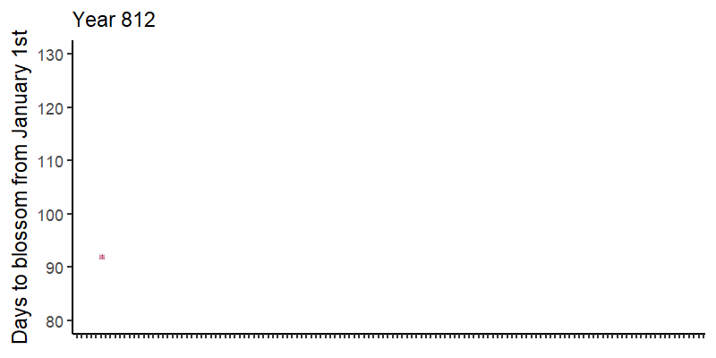
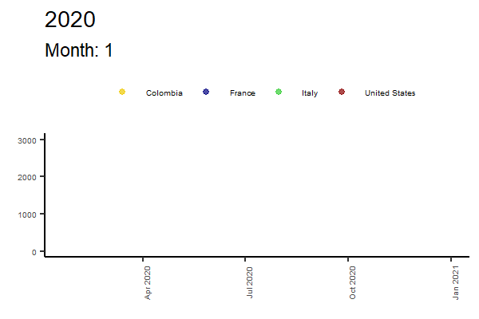
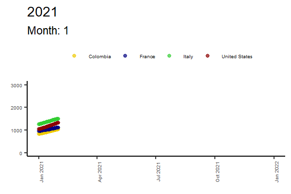
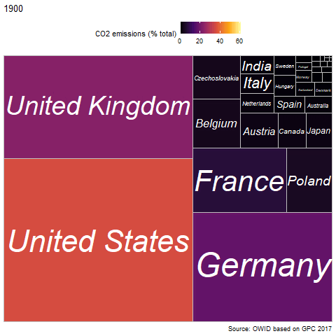
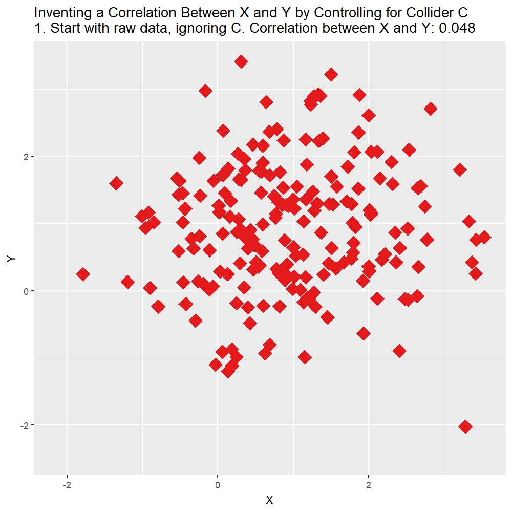

> *"The greatest value of a picture is when it forces us to notice what we never expected to see"* <br>--John Tukey

## PART I: Cherry tree blossoms {-}

People in Kyoto have been keeping track of the day the cherry trees blossom since the year 812. You can find the [data here](http://atmenv.envi.osakafu-u.ac.jp/aono/kyophenotemp4/). 

### Sakura

Let's first plot it and add a smoothing LOESS curve. We'll use **`ggimages`** to change the point to an image of a cherry blossom and **`ggpp`** to add a plot inside of another plot that focuses attention on one part, with the `geom_plot()` function. This way we can focus attention on a particular part of the graph.

Notice that during the XX century the cherries started to blossom way earlier than they did for over a millenia.

::: column-margin

:::

```{r sakura-figures}
#| fig-cap: "A thousand years of cherry tree blossoms in Kyoto"
library(tidyverse)
library(ggimage)
library(ggpp)
library(readxl)

# First we upload the data and create a date variable ####
sakura_data <- readxl::read_excel(paste0(getwd(),"/KyotoFullFlower7.xlsx"), skip = 25) |> # <1> #"/sessions_workshop/04-animate/",
  tidyr::drop_na() |> # <2>
  dplyr::rename("year"=1,"blossom"=2) |> # <3>
  dplyr::mutate(year = lubridate::make_date(year)) # <4>
  
# Now we create a plot for only the XX century.  ####
sakura_xx <- tibble(x=lubridate::as_date("1800-01-01"), y=60, # <5>
                    # I save the plot as a list
                    plot = list(sakura_data |> # <5>
                                  dplyr::filter(year>1900) |> # <5>
                                  ggplot(aes(x=year, y=blossom))+ # <5> 
                                  geom_point()+ # <5>
                                  geom_smooth(method="lm", color="red")+  # <5>
                                  ylim(c(85,110))+  # <5>
                                  scale_x_date(date_breaks = "5 years", date_labels = "%Y")+  # <5>
                                  labs(y=NULL, x=NULL)+ # <5>
                                  theme_classic()+  # <5>
                                  theme(axis.text.x = element_text(angle=90), # <5>
                                        text = element_text(size=7)) # <5>
                                ) # <5>
                    )

# Now I create the plot ####
sakura <- sakura_data |> 
  dplyr::mutate(sakura = paste0(getwd(),"/sakura.jpg")) |> #"/sessions_workshop/04-animate/", # <6>
  ggplot(aes(x=year, y=blossom))+ 
  geom_plot(data = sakura_xx, aes(x,y,label=plot))+  # <7>
  annotate(geom="rect", xmin=lubridate::as_date("1900-01-01"), xmax=lubridate::as_date("2022-01-01"), # <8>
           ymin=82,ymax=110,  # <8>
           linetype="dotted", fill="grey80", color="black")+  # <8>
  annotate(geom="rect", xmin=lubridate::as_date("1300-01-01"), xmax=lubridate::as_date("1800-01-01"), # <8>
           ymin=60,ymax=90, # <8>
           linetype="dotted", fill=NULL, color="black")+  # <8>
  geom_image(aes(image=sakura), size=0.02)+ # <9>
  geom_smooth(method="loess", color="pink")+ # <10>  
  ylim(c(60,130))+ # <10>
  scale_x_date(date_breaks = "50 years", date_labels = "%Y")+ # <10>
  labs(y="Days to blossom from January 1st", # <10>
       x=NULL,  # <10>
       caption = "Source: NOAA paleo phenology data and \nHistorical Series of Phenological data for Cherry Tree Flowering at Kyoto City\n by Aono and Kazui, 2008; Aono and Saito, 2010.")+  # <10>
  theme_classic()+ # <10>  
  theme(axis.text.x = element_text(angle=90)) # <10>

sakura

```
1. Load the data
2. Drop years without dates
3. Rename variables
4. Transform variable to a date using `make_date()` function from **`lubridate`** package
5. We first create a tibble with the coordinates where we want our inside plot to be, and a ggplot object saved as a list (all ggplot objects are lists!). We customise the plot, as always
6. To use **`ggimages`** we need to create a variable with the location of the image file in our directory. The image can vary per observation.
7. We use the `geom_plot()` geometry to embed a plot within a plot, using the label aesthetic to place the plot and data from the tibble we just created.
8. We create some annotations to box the plot within the other plot
9. We change the shape of the point for an image stored locally or in a URL using the `geom_image()` geometry and the image aesthetic.
10. We add a LOESS curve and some additional features

::: {.callout-tip}
## Handle dates with **[lubridate](https://lubridate.tidyverse.org/)**

Dates are notoriously annoying to handle, but the [lubridate](https://lubridate.tidyverse.org/) package makes it way easier.
:::

### Sakura animated

To introduce animation with **`gganimate`** package, let's drop the inference from the smooth curve and add two lines of code to the ggplot: `transition_time()`, which will create one frame per year in the data, and `shadow_mark()`, which will keep old values once they are shown.

What do these functions mean? How do they work? How do you export the animations? 

```{r sakura-animation}
library(tidyverse)
library(lubridate)
library(ggimage)
library(gganimate)

sakura_anim <- sakura_data |> 
  dplyr::mutate(sakura = paste0(getwd(), "/sakura.jpg")) |> #"/sessions/04-animate", # <11>
  dplyr::mutate(y=lubridate::year(year)) |> # <12>
  ggplot(aes(x=year, y=blossom))+ # <13>
  geom_image(aes(image=sakura), size=0.02)+  # <13>
  ylim(c(80,130))+ # <13>
  scale_x_date(date_breaks = "10 years", date_labels = "%Y")+ # <13>
  labs(y="Days to blossom from January 1st",  # <13>
       x=NULL, # <13>
       subtitle = "Year {frame_time}")+ # <14>
  theme_classic()+ 
  theme(axis.text.x = element_blank())+
  gganimate::transition_time(as.integer(y))+ # <15>
  gganimate::shadow_mark() # <16>

```
11. We create a variable that indicates where the image we plan to use as a point is stored
12. Create a separate year variable for the animation using the `year()` function
13. We create out ggplot 
14. We use the `{frame_time}` option within the brackets so the animation saves the year for each frame
15. We define the `transition_time()` as an integer of years, which will be our animation variable. `as.integer()` makes sure the dates don't include decimals.
16. We add `shadow_mark()` so old points are displayed as well. 

```{r sakura-save}
#| include: false
#| eval: false
library(gganimate)
library(magick)

# cherry ####
gganimate::anim_save(animation = sakura_anim, 
                     filename = paste0(getwd(),"/cherry-blossoms.gif"),
                     height = 400,
                     width = 800,
                     units = "px",
                     res = 150)
``` 

```{r sakura}
#| echo: false
#| column: margin
#| fig-cap: "Hey, plots in the margins!"

library(tidyverse)
library(lubridate)
library(ggimage)

sakura
``` 



::: {.callout-tip}
## Always check the package vignettes!

Check out the [**`gganimate`**](https://gganimate.com/reference/index.html) references to learn what options best suit your project
:::

## PART II: COVID-19 & C02 emissions {-}

Now let's turn to another topics. First we'll create an animation at what has happened over the past few years with the COVID-19 pandemic, then we'll turn to pollution.

### COVID-19 data from OWID

First, we're going to use the data from the [COVID-19 repository from Our World in Data](https://github.com/owid/covid-19-data/tree/master/public/data) available in GitHub.

```{r 4.covid}

library(tidyverse)

owid_covid <- readr::read_csv("https://raw.githubusercontent.com/owid/covid-19-data/master/public/data/owid-covid-data.csv")
```

### COVID-19, a grim movie

Now we're going to paint a grim picture: The evolution of COVID-19 related deaths per million inhabitants, in each of our countries, in 2020 and 2021.

We will first create ggplot objects for each year using a simple loop and store them in a list. Then we'll add a few simple **`gganimate`** parameters and voila, animation done. The key parameter is the one that defines the transition between different moments `transition_time()` where we add our time variable. The rest is just decoration to smooth the change between one state and the next one, showing each new state while keeping the old ones, and define how each state is introduced.

```{r 4.covid-animation}

library(tidyverse)
library(RColorBrewer)
library(lubridate) # Useful for handling dates
library(gganimate) # Animate ggplot objects

# Create empty lists ####
covid_plot <- list()
covid_animation <- list()

# Loop ####
for(i in c(2020:2021)) {

 # Step 1:  Create plot for each year 
 covid_plot[[paste0("year_",i)]] <- owid_covid %>%
  # Format date
  dplyr::mutate(date = lubridate::as_date(date),
                n = row_number(),
                year = lubridate::year(date)) |>
  # Filter countries using the %in% operator
  dplyr::filter(iso_code %in% c("COL","ITA","FRA","USA"), year %in% i) |>
  ggplot(aes(x=date,y=total_deaths_per_million,color=location))+
  geom_point(alpha=0.7)+
  labs(title = i,
       # Notice the bracket term, which will show the frame rate for the animation we define below
       subtitle = "Month: {frame_time}",
       x=NULL,
       y=NULL)+
  scale_color_manual(values=c("gold2","navy","limegreen","red4"))+
  ylim(c(0,3000))+
  theme_classic()+
  guides(fill=guide_legend(ncol=1))+
  theme(legend.position = "top",
        legend.title = element_blank(),
        legend.text = element_text(size = 5),
        axis.text.x = element_text(angle = 90,size = 5),
        axis.text.y = element_text(size = 5)
        )
   
# Step 2: Animate plot for each year
 covid_animation[[paste0("year_",i)]] <- covid_plot[[paste0("year_",i)]]  +
  # Add the animation
  gganimate::transition_time(as.integer(lubridate::month(date)))+
  # Add shadow to show previous points 
  gganimate::shadow_mark()+
  # Enter options for each new state/time
  gganimate::enter_fade()
}
```

```{r}
#| include: false
#| eval: false
library(gganimate)
library(magick)

# 2020 ####
gganimate::anim_save(animation = covid_animation[[1]], 
                     filename = paste0(getwd(),"/covid_anim_2020.gif"),
                     height = 400,
                     width = 600,
                     units = "px",
                     res = 150)
# 2021 ####
gganimate::anim_save(animation = covid_animation[[2]],
                     filename = paste0(getwd(),"/covid_anim_2021.gif"), 
                     height = 400,
                     width = 600,
                     units = "px",
                     res = 150)

# Cover for blog ####
covid_cover <- owid_covid %>%
  dplyr::mutate(date = lubridate::as_date(date),
                n = row_number(),
                year = lubridate::year(date)) |>
  dplyr::filter(iso_code %in% c("COL","ITA","FRA","USA"), year %in% 2021) |>
  ggplot(aes(x=date,y=total_deaths_per_million,color=location))+
  geom_point(alpha=0.7)+
  labs(subtitle = "Month: {frame_time}",
       x=NULL,
       y=NULL)+
  scale_color_manual(values=c("gold2","navy","limegreen","red4"))+
  theme_void()+
  theme(legend.position = "top",
        legend.title = element_blank())+
  gganimate::transition_time(as.integer(lubridate::month(date)))+
  gganimate::shadow_mark(future = FALSE)+
  gganimate::enter_fade() 

gganimate::anim_save(animation = covid_cover,
                     filename = paste0(getwd(),"/covid_anim.gif"),
                     res = 150)


``` 

:::{.column-screen-right layout-ncol=2}

{#fig-2020}

{#fig-2021}

:::

<br>
Even though Italy was the locus for the spread of the virus in Europe, the speed of deaths tapered off before the end of the first year of the pandemic. Same for France. In Colombia the deaths grew very quickly, exponentially, and ended up being higher than the two European countries. 

### CO2 emissions

We find the repository from the [Our World in Data](https://github.com/owid/owid-datasets/tree/master/datasets/Annual%20share%20of%20CO2%20emissions%20OWID%20based%20on%20GCP%2C%202017) and import the data.

Now we use the package **`treemapify`** to build a treemap of the distribution of emissions through time using the `geom_treemap()` geometry. We place the the `inferno` option for the fill in the **`viridis`** package and done.

```{r 4.c02-anim}
library(treemapify)
library(tidyverse)
library(janitor)
library(gganimate)
library(viridis)

owid_co2 <- readr::read_csv("https://raw.githubusercontent.com/owid/owid-datasets/master/datasets/Annual%20share%20of%20CO2%20emissions%20(OWID%20based%20on%20GCP%2C%202017)/Annual%20share%20of%20CO2%20emissions%20(OWID%20based%20on%20GCP%2C%202017).csv") |>
  janitor::clean_names() |>
  dplyr::rename(co2=3)

co2_anim <- owid_co2 |>
  dplyr::filter(year>1899) |>
  ggplot(aes(area = co2,fill=co2, label=entity)) +
  treemapify::geom_treemap()+
  treemapify::geom_treemap_text(
    fontface = "italic", 
    colour = "white", 
    place = "centre",
    grow = TRUE)+
  scale_fill_viridis_c(option = "inferno", name = "CO2 emissions (% total)")+
  labs(title = "{closest_state}", caption = "Source: OWID based on GPC 2017")+
  theme(legend.position = "top")+
  gganimate::transition_states(as.integer(year))+
  ease_aes("linear")

```

```{r c02-save}
#| include: false
#| eval: false

library(gganimate)

gganimate::animate(co2_anim, duration = 15, fps = 15, nframes = 200)

gganimate::anim_save(animation = last_animation(),
                     filename = paste0(getwd(),"/co2_anim.gif"),
                     res = 150)
```

{#fig-c02}

## Bonus track: Correlation, causation --and why data never speaks for itself {-}

*"While correlation does not imply causation, causation does imply correlation"* wrote Daniel Kahneman in his latest book [**Noise**](https://www.amazon.com/Noise-Flaw-Human-Judgment/dp/B08LNYM39M/ref=sr_1_1?keywords=daniel+kahneman+noise&qid=1668962412&sr=8-1). Mr Kahneman, I'm afraid you are wrong. By a mile. Let's see why.

We only need to prove that a causal relationship might not reflect a correlation. This is surprisingly easy to do, conceptually and statistically. Let's first see a simple simulation and then look at a nice example from Scott Cunningham's [*Causal Inference: The Mixtape"*](https://mixtape.scunning.com/).

The simple setup below shows two random variables $X$ and $Y$ that represent 10 000 independent tosses of a fair coin. Now let's build another variable $Z$ that takes the value of 1 when $X$ and $Y$ both land the same result, heads of tails. This means that $Z$ is, by definition, causally dependent on both $X$ and $Y$, as when both variables are equal, $Z$ is "turned on".

```{r cause-cor}
X <- rbinom(seq(1:1e4),1,0.5)
Y <- rbinom(seq(1:1e4),1,0.5)
Z <- ifelse(X==Y,1,0)
``` 

Now what do you think is the correlation between $X$ and $Z$? and what about the correlation between $Y$ and $Z$? Let's calculate them both:

```{r}
#| fig-cap: "No, causation does not imply correlation"
#| echo: false
library(flextable)
library(tidyverse)

tibble(correlations = c("Between X and Y","Between X and Z","Between Y and Z"),
       values = c(cor(X,Y),cor(X,Z),cor(Y,Z))
       ) |>
  flextable::flextable(cwidth = 0.75) |>
  flextable::set_caption(caption = "Causation without correlation") |>
  flextable::set_table_properties(layout = "autofit") |>
  flextable::bg(i=1, bg = "cyan") |>
  flextable::bg(i=2:3, bg = "orange") 

```

How the hell are these correlations bordering 0 if these variables are actually causally determined? Aren't these correlations supposed to be high, close to 1 or -1? What is going on? 

Run the code again. Make the samples bigger. This is not a fluke.

Well, it turns out that this is a case of a ***collider***, and one of the many reasons why you cannot ignore causal inference theory.

::: {.column-margin}

:::

### Animate to understand: Causal inference

The tool for thinking about these traps is the **DAG** --a *directed acyclic graph* where arrows mean "causes". Our coin-toss example looks like this: two arrows pointing *into* Z make it a **collider**, and conditioning on a collider opens a spurious path between its parents. Drawing the graph takes four lines with **`ggdag`**:

```{r collider-dag}
library(dagitty)
library(ggdag)

dagify(
  W ~ Y,
  W ~ Z,
  coords = list(x = c(Y = 2, Z = 1, W = 1.5),
                y = c(Y = 1, Z = 1, W = 2))
) |>
  ggplot(aes(x = x, y = y, xend = xend, yend = yend)) +
  geom_dag_edges() +
  geom_dag_point(color = "grey80", size = 10) +
  geom_dag_text() +
  theme_void()


``` 

### A spurious correlation is born: Collider bias

```{r collider-anim}
library(tidyverse)
library(gganimate)
library(ggthemes)

# Create collider ####
collider_data <- tibble(X = rnorm(200)+1,
                        Y = rnorm(200)+1,
                        time="1") %>%
  dplyr::mutate(C = ifelse((X + Y + rnorm(200)/2)>2,1,0)) %>%
  dplyr::group_by(C) %>%
  dplyr::mutate(mean_X=mean(X),mean_Y=mean(Y)) %>%
  dplyr::ungroup() 
  #dplyr::mutate(Y_hat = predict(lm(Y~X,data=collider_data)))

cor(collider_data$X,collider_data$Y)

# Calculate correlations ####
collider_before_cor <- paste("1. Start with raw data, ignoring C. Correlation between X and Y: ",round(cor(collider_data$X,collider_data$Y),3),sep='')

collider_after_cor <- paste("7. Analyze what's left! Correlation between X and Y controlling for C: ",round(cor(collider_data$X-collider_data$mean_X,collider_data$Y-collider_data$mean_Y),3),sep='')

# Add animation steps: 2 (demean X), 3 (demean X and Y) and 4 (label)
collider_full <- dplyr::bind_rows(
  #Step 1: Raw data only
  collider_data %>% 
    dplyr::mutate(mean_X=NA,mean_Y=NA,C=0,time=collider_before_cor),
  #Step 2: Raw data only
  collider_data %>% 
    dplyr::mutate(mean_X=NA,mean_Y=NA,time='2. Separate data by the values of C.'),
  #Step 3: Add x-lines
  collider_data %>% 
    dplyr::mutate(mean_Y=NA,time='3. Figure out what differences in X are explained by C'),
  #Step 4: X de-meaned 
  collider_data %>% 
    dplyr::mutate(X = X - mean_X,mean_X=0,mean_Y=NA,time="4. Remove differences in X explained by C"),
  #Step 5: Remove X lines, add Y
  collider_data %>% 
    dplyr::mutate(X = X - mean_X,mean_X=NA,time="5. Figure out what differences in Y are explained by C"),
  #Step 6: Y de-meaned
  collider_data %>% 
    dplyr::mutate(X = X - mean_X,Y = Y - mean_Y,mean_X=NA,mean_Y=0,time="6. Remove differences in Y explained by C"),
  #Step 7: Raw demeaned data only
  collider_data %>% 
    dplyr::mutate(X = X - mean_X,Y = Y - mean_Y,mean_X=NA,mean_Y=NA,time=collider_after_cor)) |>
  dplyr::mutate(C = factor(C))

collider_anim <- collider_full |>
  ggplot(aes(y=Y,x=X,color=C))+
  geom_point(aes(shape=C), size=6)+
  geom_vline(aes(xintercept=mean_X))+
  geom_hline(aes(yintercept=mean_Y))+
  guides(color=guide_legend(title="C"))+
  scale_color_brewer(palette="Set1")+
  scale_shape_manual(values = c(18,19))+
  labs(title = 'Inventing a Correlation Between X and Y by Controlling for Collider C \n{next_state}')+
  theme(legend.position = "none")+
  gganimate::transition_states(time,
                    transition_length=c(1,12,32,12,32,12,12),
                    state_length=c(500,500,500,500,500,500,500),
                    wrap=FALSE)+
  gganimate::ease_aes('sine-in-out')+
  gganimate::exit_fade()+
  gganimate::enter_fade()

```

```{r}
#| include: false
#| eval: false
library(gganimate)
library(magick)

# Collider ####
gganimate::anim_save(animation = collider_anim, 
                     filename = paste0(getwd(),"/collider.gif"),#
                     height = 1000,
                     width = 1000,
                     units = "px",
                     res = 150)

``` 

{#fig-collider width=75%}

### The Mixtape example: beauty, talent, and the movies

Scott Cunningham's [*Causal Inference: The Mixtape*](https://mixtape.scunning.com/) opens the collider chapter with a beautiful puzzle: among movie stars, beauty and talent seem *negatively* correlated --the gorgeous ones can't act, the brilliant ones look ordinary. Sinister? No: **selection**. Suppose beauty and talent are independent in the population, but you only become a star if the *sum* of the two is high enough. Looking only at stars *is* conditioning on a collider (stardom is caused by both), and it manufactures a negative correlation out of thin air.

You don't have to take my word for it --run the selection yourself below.

### Touch it: three graphs, one toggle {.unnumbered}

Each tab simulates 300 observations from a different causal structure. Every tab has **one switch**. Before you flip it, look at the DAG and decide what *should* happen. Then flip.

```{r causal-sim-data}
#| code-fold: true
#| code-summary: "The simulations behind the toggles (click to read)"

library(tidyverse)
set.seed(4)
n <- 300

# 1. Confounder: wealth causes both chocolate and Nobels. No arrow X -> Y.
wealth    <- rbinom(n, 1, 0.5)
chocolate <- rnorm(n) + 2.5 * wealth
nobels    <- rnorm(n) + 2.5 * wealth
conf <- tibble(
  x = chocolate, y = nobels, group = ifelse(wealth == 1, "Rich", "Poor"),
  x_adj = resid(lm(chocolate ~ wealth)),   # <1>
  y_adj = resid(lm(nobels ~ wealth))       # <1>
)

# 2. Mediator: education raises skill, skill raises wages. Effect is REAL.
education <- rnorm(n)
skill     <- education + rnorm(n) / 2
wages     <- 1.5 * skill + rnorm(n) / 2
med <- tibble(
  x = education, y = wages, group = ifelse(skill > median(skill), "High skill", "Low skill"),
  x_adj = resid(lm(education ~ skill)),
  y_adj = resid(lm(wages ~ skill))
)

# 3. Collider: beauty and talent are independent; stardom needs their sum.
beauty <- rnorm(n)
talent <- rnorm(n)
star   <- (beauty + talent + rnorm(n) / 4) > 1.2
coll <- tibble(x = beauty, y = talent, group = ifelse(star, "Movie star", "The rest of us"))

ojs_define(conf_r = conf, med_r = med, coll_r = coll) # <2>
```

1. "Adjusting" here is done the honest way, by **residualizing**: we keep only the part of each variable that the third variable does *not* explain. This is exactly what the step-by-step demeaning animation above does, and exactly what multiple regression does for you silently.
2. `ojs_define()` hands R objects to **Observable JS**, Quarto's built-in language for interactive graphics --this is what makes the toggles below react instantly, with no server behind this page.

```{ojs}
//| echo: false
fitSlope = (data) => {
  const mx = d3.mean(data, d => d.x), my = d3.mean(data, d => d.y);
  return d3.sum(data, d => (d.x - mx) * (d.y - my)) / d3.sum(data, d => (d.x - mx) ** 2);
}
causalPlot = (data, xlab, ylab, colors) => Plot.plot({
  height: 380,
  color: {legend: true, range: colors},
  x: {label: xlab},
  y: {label: ylab},
  marks: [
    Plot.dot(data, {x: "x", y: "y", fill: "group", opacity: 0.65, r: 3.5}),
    Plot.linearRegressionY(data, {x: "x", y: "y", stroke: "#F75431", strokeWidth: 3})
  ]
})
```

::: {.panel-tabset}

## Confounder

Wealthy countries eat more chocolate *and* win more Nobel prizes --there is **no arrow** between chocolate and Nobels. Adjusting for wealth is the *right* move here: it should make the slope vanish.

```{ojs}
//| echo: false
viewof adj_conf = Inputs.toggle({label: "Adjust for wealth (Z)"})
conf_data = transpose(conf_r).map(d => ({x: adj_conf ? d.x_adj : d.x, y: adj_conf ? d.y_adj : d.y, group: d.group}))
md`DAG: **Chocolate ← Wealth → Nobels**. Slope of the orange line: **${fitSlope(conf_data).toFixed(2)}** ${adj_conf ? "— adjusted: the illusion is gone." : "— unadjusted: chocolate 'causes' Nobel prizes?"}`
causalPlot(conf_data, "Chocolate consumption", "Nobel prizes", ["#8c6bb1", "#226F7F"])
```

## Mediator

Education raises skill, and skill raises wages --the effect of education is **real**, and it flows *through* skill. Adjusting for the mediator is the *wrong* move if you want the total effect: it destroys the very thing you are measuring.

```{ojs}
//| echo: false
viewof adj_med = Inputs.toggle({label: "Adjust for skill (M)"})
med_data = transpose(med_r).map(d => ({x: adj_med ? d.x_adj : d.x, y: adj_med ? d.y_adj : d.y, group: d.group}))
md`DAG: **Education → Skill → Wages**. Slope of the orange line: **${fitSlope(med_data).toFixed(2)}** ${adj_med ? "— adjusted: you just erased a real effect." : "— unadjusted: the true total effect."}`
causalPlot(med_data, "Education", "Wages", ["#41ab5d", "#226F7F"])
```

## Collider

Beauty and talent are **independent** --but only people with plenty of at least one become movie stars. Restricting to stars *is* adjusting for a collider: it should invent a negative slope that exists nowhere in the population.

```{ojs}
//| echo: false
viewof only_stars = Inputs.toggle({label: "Look only at movie stars (condition on C)"})
coll_data = transpose(coll_r).filter(d => only_stars ? d.group === "Movie star" : true)
md`DAG: **Beauty → Stardom ← Talent**. Slope of the orange line: **${fitSlope(coll_data).toFixed(2)}** ${only_stars ? "— among stars only: a correlation born from selection." : "— everyone: no relationship, as designed."}`
causalPlot(coll_data, "Beauty", "Talent", ["#F75431", "#999999"])
```

:::

The moral fits in one sentence, and it is the most important sentence in this workshop: **whether you should adjust for a variable depends on the causal structure, not on the data** --the data looked identical across two of those tabs until you flipped the switch, and the right answer was "adjust" in one and "don't you dare" in the other.

::: callout-tip
## Go deeper

-   [**The DAG Almanac**](https://dags.andrewheiss.com/) by Andrew Heiss --interactive confounders, mediators and colliders, with the do-calculus behind them (and it's built with Quarto, like this site).
-   [**Understanding adjustment**](https://rpsychologist.com/descriptive-adjustment/) by Kristoffer Magnusson --the most beautiful interactive explanation of what "controlling for" really does.
-   *The Mixtape* [chapter on DAGs](https://mixtape.scunning.com/03-directed_acyclical_graphs), free online.
-   Play more: this repo ships two little Shiny simulators, live below --or run them yourself with `shiny::runApp("shiny/collider")` / `shiny::runApp("shiny/r4dev-ovb")`.
:::

::: {#collider-ovb .column-screen-inset layout-ncol="2"}
```{=html}
<iframe src="https://nelsonamayad-r4dev-collider.share.connect.posit.cloud/" style="border: none; width: 100%; height: 900px" frameborder="0">
</iframe>
```
```{=html}
<iframe src="https://nelsonamayad-r4dev-ovb.share.connect.posit.cloud/" style="border: none; width: 100%; height: 900px" frameborder="0">
</iframe>
```
:::

## 🏗 Practice 4: Make it move {-}

::: {.callout-note icon="false" collapse="true"}
# Easy
- Make an animation of any data we've used so far
- Save it as a .gif and share it with the group
:::

::: {.callout-important icon="false" collapse="true"}
# Intermediate
- Choose one [causal graph from Nick Huntington Klein's GitHub page](https://github.com/NickCH-K/causalgraphs) and replicate it.
- Describe it
- In the three-toggle explainer above, the mediator tab erases a *real* effect when you adjust. Simulate a fourth structure --a chain with a confounder on top (**Z → X, Z → Y, X → M → Y**)-- and decide: which variables do you adjust for to recover the true effect of X on Y? Verify with `lm()`
:::

