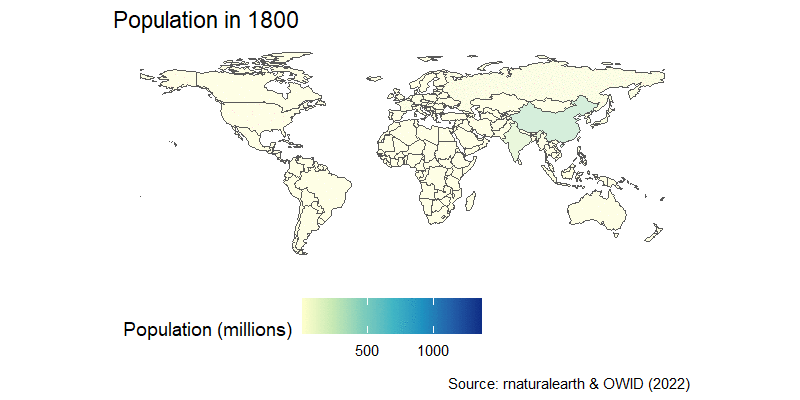
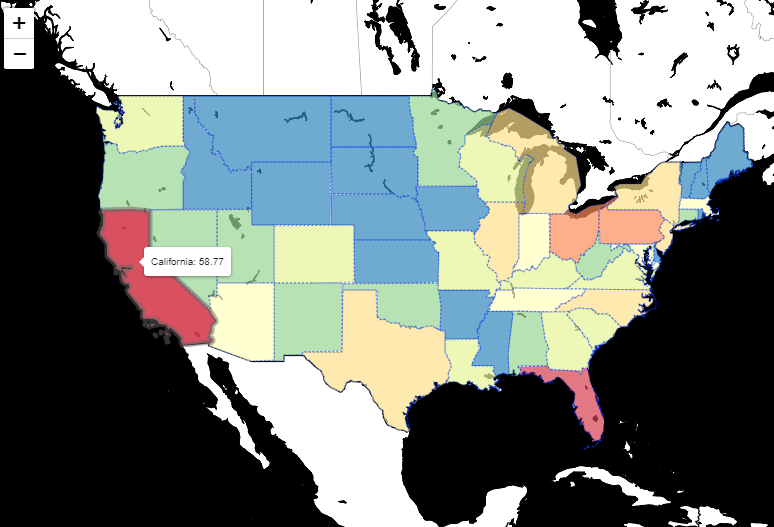
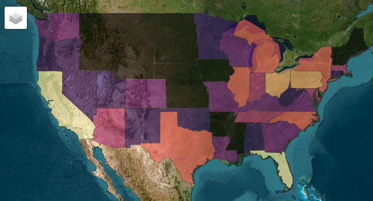

> *Drug abuse has become rampant in America and may be the worst the country has ever experienced.*<br>--Angus Deaton & Anne Case

::: {.lesson-info}
**Level:** Intermediate &nbsp;·&nbsp; **Time:** ~90 min &nbsp;·&nbsp; **Prerequisites:** Everything in its right place &nbsp;·&nbsp; **Tools:** sf, ggiraph, leaflet, rayshader
:::

## You will learn to

- Find, download and join spatial data with the numbers you want to map.
- Build a static choropleth map with ggplot2 and sf.
- Add interactivity with ggiraph and build a fully interactive map with leaflet.
- Understand what a coordinate reference system (CRS) is and why it matters.
- Render a 3D map with rayshader.

## PART I: Walk before you run

Knowing how to build maps in R is mostly about navigating which packages and functions to use. Then it's just about joining data between the spatial objects and the data objects you want to portray. Once you learn how to download spatial data, we'll illustrate how to map it using the US opioid epidemic as an example.

Let's start by reviewing the most useful packages and what each one does.

```{r 5.mapping-packages}
#| echo: false
library(reactable)
library(reactablefmtr)
library(tidyverse)

tibble(
  package_name = c(
    "sf",
    "geodata",
    "ggthemes",
    "leaflet",
    "mapview",
    "rayshader",
    "rnaturalearth",
    "terra",
    "tidyterra"),
  package_description = c(
    "Simple features objects for mapping",
    "Get coordinates in many formats",
    "Simple themes for maps",
    "To build interactive maps",
    "Light interactive maps",
    "Outstanding 3D maps",
    "World maps in multiple formats and resolutions",
    "Spatial Data Analysis",
    "Tidy tools for terra"
    ),
  package_vignette = c(
    "https://r-spatial.github.io/sf/",
    "https://github.com/rspatial/geodata",
    "https://yutannihilation.github.io/allYourFigureAreBelongToUs/ggthemes/",
    "https://rstudio.github.io/leaflet/",
    "https://r-spatial.github.io/mapview/",
    "https://www.rayshader.com/",
    "https://github.com/ropensci/rnaturalearth",
    "https://rspatial.org/pkg/",
    "https://dieghernan.github.io/tidyterra/"
    )
) |>
  dplyr::mutate(package_name = str_c("library(",package_name,")")) |>
  dplyr::mutate(package_name = sprintf("<a href='%s' target='_blank'>%s</a>", package_vignette, package_name)) |>
  dplyr::select(package_name,package_description) |>
  reactable::reactable(
    columns = list(
      package_name = colDef(name = "Package",  html = TRUE),
      package_description = colDef(name = "Description")
    ),
    highlight = TRUE, 
    striped = TRUE, 
    resizable = TRUE,
    theme = journal(font_size=14)
    )
```

### 8 billion: A short detour to learn about simple features (sf) {.unnumbered}

The world just hit 8 billion human population in 2022, so before we start looking at mapping in general, we'll start with the easiest build a simple worldmap using the package **`sf`**, which is one of the most powerful geospatial packages available in R.

Geospatial data comes in many forms, and it's useful to start by looking closely at one of them. There is a handy cheat sheet for this package that you can find [here](https://github.com/rstudio/cheatsheets/blob/main/sf.pdf)

We'll download an sf map of the world using **`rnaturalearth`** package and then map world population. Take a close look at the coordinate system inside the last column in the world_sf map we downloaded. This column geometry is special, as it holds all the coordinates needed to plot define the border of each country, and is a key input of `geom_sf()`.

```{r 5.sf-intro}
#| message: false
#| warning: false

library(sf)            # Simple object package
library(rnaturalearth) # Contains a sf world map
library(ggthemes)      # Gives us themes for maps
library(tidyverse)     # Our old friends

world_sf <- rnaturalearth::ne_download(returnclass = "sf") # <1>

world_sf |> # <2>
  dplyr::filter(ISO_A3!="ATA") |> # <3>
  ggplot()+ # <4>
  geom_sf( # <5>
    aes(fill=as.integer(POP_EST)/1e6,  # <5>
        geometry=geometry),  # <5>
    alpha=0.5)+ # <6>
  scale_fill_distiller( # <7>
    palette = "PuBuGn", # <7>  
    direction=1, # <7>
    name = "Population estimates\n (millions)")+ # <7>
  labs(title="A simple world population map",
       caption="Source: rnaturalearth")+
  ggthemes::theme_map()

```

1.  Let's download the worldmap as a sf file. Look at the file in the Viewer, what is different from other data frames? The **geometry** column
2.  Start with the map object
3.  Exclude Antarctica
4.  Feed data into ggplot
5.  Use the `geom_sf()` function with the aesthetics geometry and fill with the variable of interest
6.  Control transparency of the objects with `alpha`
7.  Add fill and name to the legend

### Rejoinder: How we got to 8 billion -- The movie {.unnumbered}

The population map can be easily turned into an animation, as you learned in the previous session. We can join the country-estimated population since 1800, which is available from OWID GitHub repository in a nice CSV format, and then we're in familiar territory.

After a little wrangling where we use the **`countrycode`** package to join the map and population data, we add a time transition and a little formatting to get this result:

```{r 5.population-animation}
#| eval: false
#| message: false
#| warning: false

library(tidyverse)
library(gganimate)
library(transformr)
library(countrycode)

world_sf <- rnaturalearth::ne_download(returnclass = "sf")

owid_pop_url <- "https://raw.githubusercontent.com/owid/owid-datasets/master/datasets/Population%20by%20country%2C%201800%20to%202100%20(Gapminder%20%26%20UN)/Population%20by%20country%2C%201800%20to%202100%20(Gapminder%20%26%20UN).csv"

world_pop_anim <- readr::read_csv(owid_pop_url) |> # <8>
  dplyr::filter(str_ends(Year,"0"), Year<2020) |> # <9>
  dplyr::rename(year = Year, country=Entity,pop=4) |> # <10>
  dplyr::mutate(iso3c = countrycode::countrycode(country,"country.name","iso3c")) |> # <11>
  dplyr::right_join(world_sf |> # <12>
                      dplyr::select(ISO_A3,geometry), # <12>
                    by=c("iso3c"="ISO_A3")) |> # <12>
  dplyr::filter(iso3c!="ATA") |> # <13>
  ggplot()+
  geom_sf(
    aes(fill=pop/1e6, 
        geometry=geometry), 
    alpha=0.5)+
  scale_fill_distiller(
    palette = "YlGnBu", 
    direction=1,
    name = "Population (millions)", 
    na.value = "grey75")+
  labs(title="Population in {frame_time}",
       caption="Source: rnaturalearth & OWID (2022)")+
  theme_map()+
  theme(legend.position = "bottom")+
  gganimate::transition_time(as.integer(year))+ # <14>
  gganimate::ease_aes('linear') # <15>

```

8.  Download the data using `read_csv()`
9.  Keep data for the end of each decade by selecting dates that end with zero using the `str_ends()` function
10. Rename variables
11. Add country codes using `countrycodes()`
12. Join data to `sf` map
13. Exclude Antarctica
14. Use transition time to an integer year
15. Ease the animation using a linear scale of frames

```{r}
#| include: false
#| eval: false
library(gganimate)
library(magick)

gganimate::anim_save(animation = world_pop_anim, 
                     filename = paste0(getwd(),"/world_pop_anim.gif"),
                     height = 400,
                     width = 800,
                     units = "px",
                     res = 150)

```

::: column-body
{#fig-world-pop}
:::

### Rejoinder: **`ggiraph`** world map of GDP per capita {.unnumbered}

Reusing the Maddison Project data, we can easily build an interactive **`sf`** map of GDP per capita across the world using **`ggiraph`** and **`viridis`**.

```{r rejoinder-map}
#| message: false
#| warning: false

library(ggiraph)
library(sf)
library(tidyverse)
library(countrycode) 
library(ggthemes)
library(patchwork)
library(rnaturalearth)
library(viridis)
library(viridisLite)

# First build the pipe for ggplot ####
gdpp_gg <- readr::read_csv("https://raw.githubusercontent.com/owid/owid-datasets/master/datasets/Maddison%20Project%20Database%202020%20(Bolt%20and%20van%20Zanden%20(2020))/Maddison%20Project%20Database%202020%20(Bolt%20and%20van%20Zanden%20(2020)).csv") |>
  dplyr::select(country=1,year=2,gdppc=3) |>
  dplyr::filter(year==2018) |>
  dplyr::mutate(iso3c = countrycode::countrycode(sourcevar = country, origin = "country.name", destination = "iso3c")) |>
  dplyr::filter(!is.na(iso3c)) |>
  dplyr::left_join(rnaturalearth::ne_download(returnclass = "sf") |>
                      dplyr::select(ISO_A3_EH, geometry),
                    by=c("iso3c"="ISO_A3_EH")) |>
  ggplot()+
  geom_sf_interactive(aes(geometry=geometry, 
                          fill=gdppc, 
                          data_id = gdppc,
                          tooltip=paste0(country,
                                         "<br>GDP per capita: USD ", 
                                         gdppc |> round(digits=0) |> 
                                           format(big.mark=" "))))+
  scale_fill_viridis_c_interactive(
      trans = "log10",
      labels = scales::number_format(), 
      name = "GDP per capita 2018", 
      option = "mako")+
  coord_sf(crs = st_crs(4269))+
  theme_map()
                      
maddison_girafe <- ggiraph::girafe(
  ggobj = gdpp_gg +
          plot_annotation(
            title = 'Look, GDP per capita across the world in 2018',
            caption = 'Source: Own calculations based on Maddison Project and OWID'
            ),
  options = list( # <15>
    opts_toolbar(position = "top", pngname = "r4dev-gdppc"), # <15>
    opts_tooltip(opacity = 0.8, css = "background-color:#AC0909;color:white;padding:5px;border-radius:3px;"
), # <15>
    opts_hover(css = girafe_css( # <15>
      css = "fill:orange;stroke:gray;", # <15>
      text = "stroke:none; font-size: larger", # <15>
      line = "fill:none", # <15>
      area = "stroke-width:1px" # <15>
    )) # <15>
  ))

maddison_girafe

```

15. Additional options in `girafe`, included as a list.

## PART II: Despair in the US {.unnumbered}

Over the past two decades, over 450 000 american have died from opioid-related overdoses. The reasons are varied and summarised in [*Deaths of Despair*](https://press.princeton.edu/books/hardcover/9780691190785/deaths-of-despair-and-the-future-of-capitalism) by Angus Deaton & Anne Case. [*Empire of Pain: The Secret History of the Sackler Dynasty*](https://www.amazon.com/Empire-Pain-History-Sackler-Dynasty/dp/0385545681) by Patrick Radden Keefe shows the corporate interests behind the abuse of opioids, and chapter one *God's medicine* of [*Pandora's Lab*](https://www.amazon.com/Pandoras-Lab-Seven-Stories-Science/dp/1426217986) by Paul Offit explains how the crisis was produced by a perfect storm of regulatory loopholes, perverse corporate interests and misguided advocacy.

Let us look at this crisis through a geospatial lens.

### Getting the data from CDC using an API {.unnumbered}

The [Center for Disease Control (CDC)](https://www.cdc.gov/) has data on opioid-related deaths, called VSRR Provisional Drug Overdose Death Counts, and can be found in the US [Data.gov](https://www.data.gov/) portal. The data we are looking for is [here](https://data.cdc.gov/NCHS/VSRR-Provisional-Drug-Overdose-Death-Counts/xkb8-kh2a) and by clicking on the **API** button on the upper-right corner, choosing our format, in this case CSV, and can copy the location of the data for easy import to R.

That way we can download it straight into R with `read_csv()` --Socrata portals serve plain CSV, no special package needed[^socrata]. The only trick is the `$limit` parameter: without it, the portal politely hands you just the first 1 000 rows. Then we keep only the data we want and quickly plot it using **`ggplot2`**.

[^socrata]: Old tutorials use the `RSocrata` package for this. It was **archived from CRAN in April 2025** --package rot is real, which is one more reason to prefer plain `readr` + query parameters (the same API skills from session 2) over one-job wrapper packages.

::: column-margin
Having trouble downloading the data from the CDC?
<br>
<br>

:::

```{r 5.cdc-socrata}
library(tidyverse)     # Our old friend

# Get data from CDC portal
cdc <- "https://data.cdc.gov/resource/xkb8-kh2a.csv?$limit=500000" # <16>

opioid <- readr::read_csv(cdc) |> # <17>
  dplyr::filter(str_detect(indicator,"Drug Overdose Deaths"))  # <18>

# Plot aggregate data
opioid |>
  dplyr::select(state,state_name,year,month,data_value) |>
  dplyr::filter(state_name!="United States", year<2023, month=="December") |> # <19>
  dplyr::group_by(state_name,year) |>
  dplyr::summarize(opioid = sum(data_value)) |>
  ggplot(aes(x=year,y=opioid,color=state_name))+
  geom_line(show.legend = FALSE)+
  ggrepel::geom_label_repel(
    data = . %>% dplyr::filter(year==2022),
    aes(label = state_name))+
  labs(x=NULL,
       y="Number of Drug Overdose Deaths",
       title="The opioid crisis in the US: 2015-22",
       caption = "Source: CDC")+
  theme_classic()+
  theme(legend.position = "none")
```

```{r}
#| include: false
#| eval: false
write_csv(opioid, paste0(getwd(),"/cdc_opioid.csv"))
``` 
16. We identify the CSV version of the data we want from the CDC page, and add `$limit=500000` so the portal sends everything instead of its default 1 000-row page
17. Plain `read_csv()` on the API URL --downloading from an API and reading a local file are the same gesture. We filter only the variable we want to keep
18. `select` only the variables we want
19. **Warning**: There is a data point with aggregates for all the US. We need to exclude it.

### Coordinates for a map {.unnumbered}

With the data by state, we can now map it.

The **`geodata`** package helps us easily bring coordinates data to R. We can download many types of coordinate systems, like elevation data or administrative borders at many levels. As we need US data at a state level, we can use the command `gadm()`, which stands for *Global Administrative Areas*.

Check out the result. This is a complicated object with an intimidating name: `Formal class SpatVector`.

But we don't need to worry, as we don't need to handle this object directly to build maps: we can transform it to our now favourite **sf** object using `st_as_sf()` function, which will give us a nice geometry column we already know how to handle.

```{r 5.usmap}
library(geodata)
library(sf)
library(tidyverse)

us <- geodata::gadm(country="USA", level=1, path = getwd()) # <20> 

us_state <- sf::st_as_sf(us) # <21> 
```

20. We can retrieve coordinates for any country using `gadm()` function. We include the country code for the US and the level we want. 1 for state, 2 for county. We also include the path where the map file will be downloaded. For convenience, we save it in the folder of the project.
21. The raw object is hard to work with directly. We transform the SpatVector object to our favourite *sf* using `st_as_sf()`.

### Joining data to coordinates {.unnumbered}

Now we need only join the data from the **us_state** data frame and the opioid data we had saved before. For this we use our old friend: the `left_join()` function and the pipe. However, before all this magic happens, we find that we have a conflict: 2 packages use the same functions `filter()` and `select()` and we have to choose which one takes precedence. This is easy and fast with the **`conflicted`** package, and we choose **`dplyr`**:

```{r 5.opioid-map}

library(sf)
library(tidyverse)
library(conflicted)

conflicted::conflict_prefer("select","dplyr")
conflicted::conflict_prefer("filter","dplyr")
conflicted::conflicts_prefer(base::setdiff)

# Let's first simplify and summarize the opioid data. We'll call the new data frame opioid_states
opioid_states <- opioid |>
  dplyr::select(state_name,year,month,data_value) |>
  dplyr::filter(state_name!="United States",month=="December") |>           
  dplyr::group_by(state_name) |>
  dplyr::summarize(opioid = sum(data_value)/1000) #Change unit to thousands

# Now we join/merge the data with the spatial shapes for mapping stored in us_states
opioid_map <- us_state |>
  #This command joins/merges the data on the left (coming down the pipe) onto the data on the right (inside of the function) using the variables we provide in by=c("name of variable on the left"="name of variable on the right") option
  dplyr::left_join(opioid_states, 
                   by=c('NAME_1'="state_name"))

```

### Despair, state by state {.unnumbered}

Now we can map with **`ggplot2`** using the `geom_sf()` option, which will draw the shapes for every state based on the coordinates we downloaded before and are stored in the **us_state** data frame. Then we wrap everything around `girafe`.

First, let's use the `gdtools` package to make sure all girafe graphs use the font we like.

```{r 5-gdtools}
library(gdtools)

# Add our favourite font to girafe ####
gdtools::register_gfont("News Cycle")
gdtools::addGFontHtmlDependency(family = "News Cycle")
``` 

Now with the map:

```{r 5.opioid-epidemic}
library(sf)
library(tidyverse)
library(conflicted)
library(ggthemes)
library(ggiraph)
library(patchwork)

# Declare conflicts 
conflicted::conflict_prefer("filter", "dplyr")

# Now we can map the crisis
opioid_gg <- opioid_map |>
  # Simplify by keeping only the variables we need
  dplyr::select(state=NAME_1,opioid,geometry) |>
  #We'll exclude Alaska and Hawaii to get a better looking map, and New York City
  dplyr::filter(!state %in% c("Alaska","Hawaii","New York City")) |>
  # Feed the data into ggplot
  ggplot()+
  # We have an sf object, so we just add the geometry and use the interactive option
  ggiraph::geom_sf_interactive(
    aes(geometry = geometry,
        fill = opioid,
        tooltip = paste0(state,
                         "<br>Opioid deaths: ", opioid)),
    color=NA)+
  #Include a fill option that makes a heatmap
  ggiraph::scale_fill_distiller_interactive(palette="Spectral", name = "Deaths")+
  # CRS projection
  coord_sf(crs = st_crs(5070))+
  # A theme for maps, which cleans the background
  ggthemes::theme_map()

# Now girafe the map
opioid_girafe <- ggiraph::girafe(
  ggobj = opioid_gg + plot_annotation(
    title="Thousands of opioid overdose deaths in the US",
    subtitle = "State aggregates 2015-22",
    caption="Source: Own calculations based on CDC"),
  fonts = list(sans="News Cycle")
)

opioid_girafe
```

::: callout-tip
## A deeper understanding of coordinate reference systems (CRS)

[This handy guide explains CRS, projections and shapes to build maps](https://www.nceas.ucsb.edu/sites/default/files/2020-04/OverviewCoordinateReferenceSystems.pdf)
:::

## PART III: Interactive maps

Static maps are great but interactive maps are better. Let's see how to turn the map above into an interactive map using new and old tools.

### Heavyweight champion: Leaflet {.unnumbered}

The heatmap above made with **`ggplot2`** was a very good visualisation. But we can do better. Leaflet is a great open source tool to build interactive maps. Have a look here on the [basics](https://rstudio.github.io/leaflet/). Leaflet has a different syntax than ggplot, as we add layers over layers using the pipe **`%>%`** instead of the **`+`** sign, similar to **`plotly`**.

To build an interactive map with Leaflet we need to first summarize our data, feed it into a `leaflet()` function and then sprinkle a few leaflet tricks.

We repeat the process to summarise the data, by state, and join it into a new object **us_leaflet**. We will build a special type of interactive map called [Choropleth map](https://rstudio.github.io/leaflet/choropleths.html), so to get Leaflet to work well, we need to define the *color palette* and *scale* separately, as we will later need to use them inside of the Leaflet pipe.

So we create bins and a `pal` objects that we'll use in a later layer of leaflet:

::: callout-tip
## `leaflet` vignette

Check out the [leaflet cheatsheet](https://ugoproto.github.io/ugo_r_doc/pdf/leaflet-cheat-sheet.pdf)
:::

```{r 5.opioid-prepare}
library(tidyverse)
library(leaflet)

# Let's first simplify and summarize the opioid data. We'll call the new data frame opioid_leaf
opioid_leaf <- opioid %>%
  dplyr::select(state_name,year,month,data_value) %>%
  dplyr::filter(state_name!="United States",month=="December") %>%             
  dplyr::group_by(state_name) %>%
  dplyr::summarize(opioid = sum(data_value)/1000) #Change unit to thousands

# Join the data to a new sf object
us_leaflet <- us_state |>
  dplyr::left_join(opioid_leaf, 
                   by=c('NAME_1'="state_name")) 

# Define color palette. It will be broken by bins, and the palette will be Spectral as before
pal <- leaflet::colorBin(palette = "Spectral", 
                         domain = us_leaflet$opioid, 
                         bins = c(0, 5, 10, 15, 20, 30, 40, Inf), 
                         reverse = TRUE)

```

With the **sf** object that holds the coordinates and the opioid data, plus the color palette defined, we just feed the data to the command `leaflet()` that starts the pipe.

As it is a map of the US, we center the map using `setView()` coordinates. This is a dark topic, so we choose a dark background using [provider tiles](https://leaflet-extras.github.io/leaflet-providers/preview/). Finally, the real magic in the map comes from the `addPolygon()` option, which will create a polygon that stands out when interacting with it. Inside of this option we define the colors to depend on the palette we created `pal`, and have that palette be applied over the opioid data. The other important options we include highlights the state when you hover over the mouse using `highlightOptions()`, and `label` to create a tooltip that will show the name of the state and the number of deaths.

Now you know how to build an interactive map from scratch. Cool, no?

::: callout-warning
## ⚠️ Careful rendering `leaflet` to HTML!

Leaflet maps in HTML are amazing, but they require *lots* of computation capacity to render correctly. If you try to render the map below, make sure you do it in a separate file.
:::

::: column-margin

:::

```{r 5.opioid-choro}
#| fig.align: center
#| out-width: "100%"
#| eval: false

library(leaflet)
library(leaflet.providers)
library(tidyverse)

# Map it 
us_leaflet |>
  # Here we feed the data in the pipe to Leaflet
  leaflet() |>
  # Adding Tiles, which is the structure of the map
  addTiles() |>
  # Set the default coordinates in the middle of the US
  setView(-96, 37.8, 4) |>
  # Add a dark tile, because the topic demands it
  addProviderTiles(providers$Stadia.StamenToner) |>
  # Add polygons
  addPolygons(
    # Add colors
    fillColor = ~pal(opioid),
    weight = 1,
    dashArray = "2",
    fillOpacity = 0.7,
    # Highlight
    highlightOptions = highlightOptions(
    weight = 5,
    color = "#666",
    dashArray = "",
    fillOpacity = 0.9,
    bringToFront = TRUE),
    #Add labels
    label = paste0(us_leaflet$NAME_1, 
                   ": ",
                   us_leaflet$opioid))

```

### Lightweight champion: mapview {.unnumbered}

Leaflet is great but it is heavy and slow. [**mapview**](https://r-spatial.github.io/mapview/) solves both by cutting a few corners.

Let's build the exact same map above in mapview, using the `mapview()` function and tweaking a few options that don't have very intuitive names. For `mapview`, we define the bins using the `cut()` function, and then pipe in the data into the `mapview()` function. The option `zcol` is the one used for the heatmap, and the option `col.regions` is used to determine the color palette. 

These maps are simple, but as they built on top of leaflet, we can use leaflet options to customise the map even more. For instance, we pipe in the `setView()` option from leaflet to center the map in specific coordinates and set a default zoom level. Notice we do this on the map component of the `mapview` and we access it with **`@`**.

::: column-margin

:::

```{r 5.mapview}
#| eval: false
library(mapview)
library(leaflet)
library(leaflet.providers)
library(tidyverse)
library(viridis)

us_mapview <- us_leaflet |>
  mutate(bins = cut(opioid,
                    breaks = c(0, 5, 10, 15, 20, 30, 40, Inf),
                    include.lowest = TRUE)
         ) |>
  mapview(
    zcol = "bins",
    col.regions = viridis(
      n=7,
      direction=1,
      option = "magma"
      ),
    legend = FALSE,
    popup = FALSE
  ) 

us_mapview@map |>  
  leaflet::setView(lat=37.8,lng=-96,zoom=4)

```

### Interaction at the county level in California

The number of overdose deaths in California is very high, but is masked by the large population of the state. Let's have a closer look at the opioid crisis in California by creating an interactive graph to look at deaths by county using **`ggiraph`**, as we did before.

First, we visit again the CDC database and find the information we need by county, noting the API endpoint so we can download it with `read_csv()`. [The data we need is here](https://data.cdc.gov/NCHS/VSRR-Provisional-County-Level-Drug-Overdose-Death-/gb4e-yj24) and we import it into R as we did before.

Second, we download a map of the US using the aptly named **`usmap`** package and **`tidycensus`**[^1] to get population from the 2010 census by county for California.

[^1]: To access the US Census database you need an API Key. [Request your API key here](https://api.census.gov/data/key_signup.html), and then use it to access the data --some APIs, unlike Open-Meteo from session 2, do ask you to identify yourself.

With all the data ready, we do a little wrangling to join the opioid data and geographical data for California into a single object using the FIPS codes, which are shared by both sources of data.

::: column-margin
Having trouble downloading the data for California? 
<br>
<br>

:::

```{r 5.us-census-api}
#| include: false

# Tidycensus: the key lives in .Renviron (CENSUS_API_KEY=...), never in code ####
us_census_api_key <- Sys.getenv("CENSUS_API_KEY")

```

```{r 5.california-data}
library(usmap)  
library(tidycensus)
library(tidyverse)

# CDC data by county ####
cdc_county <- "https://data.cdc.gov/resource/gb4e-yj24.csv?$limit=500000"

opioid_california <- readr::read_csv(cdc_county) |>
  dplyr::filter(st_abbrev=="CA", year==2021, month==12)

# Tidycensus ####
tidycensus::census_api_key(us_census_api_key)
us_census <- tidycensus::get_decennial(geography = "county", variables="P001001", year=2010)

# load the map of california
california <- usmapdata::us_map(regions = "counties") |>
  # filter the map to only include california
  dplyr::filter(abbr=="CA") |>
  # create a new column called fips_new, which is the fips code without the first character
  dplyr::mutate(fips_new = stringr::str_sub(fips,start=2L) |> as.integer()) |>
  # join the opioid data to the map
  dplyr::left_join(opioid_california |>
                     dplyr::select(fips,provisional_drug_overdose), 
                   by=c("fips_new"="fips")) |>
  # join the census data to the map
  dplyr::left_join(us_census |>
                     dplyr::filter(str_detect(NAME,"California"))|>
                     dplyr::select(GEOID, pop2010=value) |>
                     dplyr::mutate(fips_census=stringr::str_sub(GEOID,start=2L) |> as.integer()),
                   by=c("fips_new"="fips_census"))

```

```{r}
#| include: false
#| eval: false
write_csv(opioid_california, paste0(getwd(),"/california_opioid.csv"))
``` 

We will create two visualisations that will be connected to one another: a scatter plot and a map. We create each graph independently using the extended geoms from **`ggiraph`** package. The key make the two interact is the data_id, which will show the name of the state when you hover the mouse over each point or county. We reuse a trick from the last session to control the image that is displayed in the visual mark using `ggimage`.

Finally, we merge both plots using the **`patchwork`** package. We place each plot side by side easily by adding it with the **`+`** operator. Then we include both graphs within `girafe()` and this is the result:

```{r 5.california-ggiraph}
library(tidyverse)
library(ggthemes)
library(ggiraph)
library(ggimage)
library(patchwork)

# Creates a scatter plot of the data ####
california_points <- california |>
  dplyr::mutate(death = paste0(getwd(),"/death.jpg")) |>
  ggplot(aes(x=pop2010, y=provisional_drug_overdose)) +
  geom_image(aes(image = death))+
  ggiraph::geom_point_interactive(
    aes(tooltip = county, data_id=county), 
    size=10, 
    shape=21,
    color="white"
    ) +
  scale_x_continuous(trans = "log10",labels = scales::number_format(big.mark=" "))+
  scale_y_log10()+
  theme_bw()+
  theme(legend.position = "none")+
  labs(x="Log population Census 2010",
       y="Log provisional overdose deaths")

# Map it ####
california_map <- california |>
  ggplot(aes(fill=provisional_drug_overdose))+
  ggiraph::geom_sf_interactive(aes(tooltip = county, data_id=county))+
  theme_map()+
  theme(legend.position = "none")

# Combines the two plots into one ####
ggiraph::girafe(
  ggobj = california_points + california_map +
    plot_annotation(
  title = 'Provisional drug overdose deaths in California, 2021',
  caption = 'Source: Own calculations based on CDC data'
),
  width_svg = 8,
  height_svg = 6,
  fonts = list(sans="News Cycle")
)
```

## Bonus track: 3D maps with [rayshader](https://www.rayshader.com/index.html)

This final application is just for fun, as 3D visuals are not incredibly informative and are hard to put together. Nevertheless, even just to showcase what R packages can do, we'll give 3D a try using the package **`rayshader`**. We'll also use the **`viridis`** package which is designed with color palettes that are mindful of colorblindness.

::: callout-tip
## rayshader, explained

Check out this [rayshader tutorial](https://www.tylermw.com/3d-ggplots-with-rayshader/)
:::

To start, we'll create a simple 2D heatmap of overdose deaths in California by county, as we did before, and save it. Before we do this, we need to make an adjustment to our data using `st_simplify()` so that the geometries are less complex.

```{r 5.california-ggplot}
library(tidyverse)
library(viridis)
library(sf)

california_simplified <- sf::st_simplify(california, preserveTopology = TRUE, dTolerance = 5e3)

california_gg <- california_simplified |>
  dplyr::filter(!is.na(provisional_drug_overdose)) |>
  ggplot(aes(fill=provisional_drug_overdose))+
  geom_sf(aes(geometry = geom))+
  scale_fill_viridis_c(trans = "log10")+
  labs(title="California overdose deaths, 2015-21",
       x=NULL,y=NULL,
       fill="Deaths")+
  theme_bw()+
  theme(axis.text = element_blank())

california_gg
  
```

Now let's render the plot in 3D using `plot_gg()` function from **`rayshader`**. It takes a long time for the visualisation to render, and the [function](https://www.rayshader.com/reference/plot_gg.html) has many customisation options like the direction to cast the shade from, the size of the resulting visual and others.

You can take snapshots of the rendered visual using `render_snapshot()`, which you can then save to use elsewhere, and `render_movie()` to get a rotating video of the plot.

```{r 5.california.rayshader}

# load the rayshader package
library(rayshader)

# create a 3D map of California
rayshader::plot_gg(california_gg,
                   multicore=TRUE,
                   width=5,
                   height=5,
                   scale=300,
                   shadow_intensity = 1,
                   pointcontract = 1,
                   raytrace = TRUE,
                   sunangle = 315,
                   windowsize=c(1280,720),
                   zoom = 0.65,
                   phi = 50)

# render the 3D map
rayshader::render_snapshot()
```

```{r 5.rayshader.movie}
#| include: false
#| eval: false

library(rayshader)
library(av)
library(gifski)

rayshader::plot_gg(california_gg,
                   multicore=TRUE,
                   width=5,
                   height=5,
                   scale=300,
                   raytrace = TRUE,
                   sunangle = 315,
                   windowsize=c(1280,720),
                   zoom = 0.65,
                   phi = 50)

# Video ####
rayshader::render_movie(filename = paste0(getwd(),"/california_rayshader.mp4"),
                        audio = paste0(getwd(),"/myth.mp3")
                        )

# GIF ####
#rayshader::render_movie(filename = paste0(getwd(),"/sessions_workshop","/california_rayshader.gif"))
```

::: column-margin


You can also render and save the resulting map to a video with the `render_movie()` function. Even include audio.
:::

Even though this particular application of rayshader is not too useful, for topographical data this method creates truly striking visualisations.

## 🏗 Practice 5: Map it {.unnumbered}

::: {.callout-note icon="false" collapse="true"}
# Basic

-   Download the geographical data for your country of origin
-   Look up any geographical variable for your country
-   Make a static heat map out of it and describe it
:::

::: {.callout-important icon="false" collapse="true"}
# Intermediate

-   Make a choropleths **`leaflet`** map of the variable you chose in the previous exercise and use **`ggiraph`** to plot the data next to the map
-   Alaska and Hawaii are unfairly excluded from US maps because of their location. Manipulate the coordinates of each state to move them to a place where you can visualise them right next to the other states.
-   Create a **`rayshader`** elevation map of your country, using data retrieved from the `elevation_30s()` function in the **`geodata`**, and then `geom_spatraster()` from **`tidyterra`** to plot in `ggplot()`. (Tip: Use the `scale_fill_hypso_c()` layer)
-   Build an interactive world map for any variable available at a country level using an **`sf`** map and **`ggiraph`**
- Check this [blog post](https://justjensen.co/making-population-density-maps-with-rayrender-in-r/) and create a high-resolution population density map for a country.
:::

## Key takeaways

- Mapping in R is mostly about picking the right packages and joining spatial data to the numbers you want to show.
- sf objects carry a coordinate reference system (CRS) with them -- get it wrong and distances and shapes distort.
- A static map (ggplot2 + sf) and an interactive one (leaflet) reuse the same underlying spatial data, just rendered differently.
- ggiraph brings the same hover/tooltip interactivity from earlier sessions to maps.
- 3D isn't always more informative than 2D, but rayshader is a good tool to have when it is.

::: {.continue-learning}
[← Previous: Making data move](/sessions_workshop/04-animate/04-animate.qmd)

[Track overview: Build with R →](/learn/build-with-r.qmd)

[Next: Just take it →](/sessions_workshop/06-scrap/06-scrap.qmd)
:::
