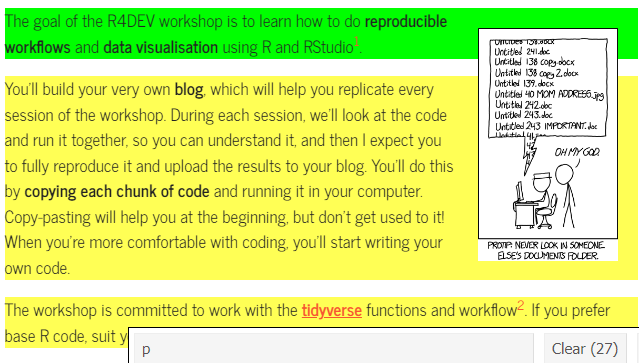
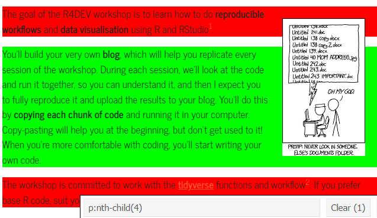
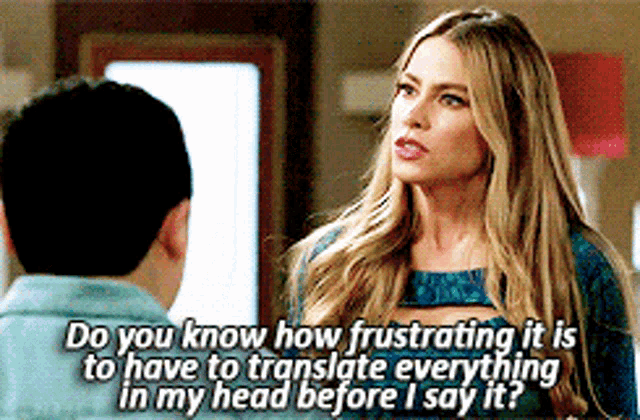

> *If it doesn't exist on the internet, it doesn't exist.*<br>--Kenneth Goldsmith

## PART I: Pick it, grab it

Although you've learned to use API and dedicated packages to get information from online sources, sometimes you want to just take a table from Wikipedia, or some text from a webpage and bring it into R.

To do this you need two tools:

1.  The **`rvest`** package, which helps read HTML pages and gather information from them
2.  Install the [**`Selector Gadget`**](https://selectorgadget.com/) Extension in your browser. This will help you select the object you want to import.

::: callout-tip
## I'll say it again: *Read* package vignettes

Check out the [**`rvest`**](https://rvest.tidyverse.org/) vignette
:::

How does the Selector Gadget work? By clicking in an HTML page until the objects you want are selected in green.

Imagine you want to extract text from the Home page of R4DEV, but you only want one paragraph. Clicking the elements you want until only what you want is highlighted in green, as shown below, will let you know which element you'll scrap. The selected element **`p:nth-child(4)`** will appear below and you can copy it to use it as it is shown below.

::: {#selector layout-ncol="2"}
{width="80%"}

{width="80%"}
:::

### Top movies according to IMDb {.unnumbered}

[IMDb](https://www.imdb.com/chart/top/) has a list of the best ranked movies. We'll pull it straight from the website using `rvest`. Using the Selector Gadget, we click on the objects of the webpage we want and bring them to the code that will pull that information and transform it into text.

We will extract the title of the movie, the year, ranking and country from the [Wikipedia](https://fr.wikipedia.org/wiki/Top_250_de_l%27Internet_Movie_Database) entry.

```{r 5.rvest}

library(tidyverse)
library(rvest)

imdb_top_url <- "https://fr.wikipedia.org/wiki/Top_250_de_l%27Internet_Movie_Database" # <1>

# Scrape ! ####
imdb_top_250_raw <- imdb_top_url %>% # <2>
  rvest::read_html() %>% # <3>
  rvest::html_elements("center:nth-child(25) td:nth-child(1), 
                       center:nth-child(25) td:nth-child(2), 
                       center:nth-child(25) td:nth-child(4),
                       center:nth-child(25) .flagicon+ a") %>% # <4>
  rvest::html_text() %>% # <5>
  tibble::as_tibble() # <5>

```
1. Save the URL of the page we want
2. Read the page as HTML with `read_html()`
3. Pull the 4 chosen objects by separating them with a comma, inside of the quotations
4. Make the result into text
5. Turn into a tibble

::: callout-tip
## A little HTML is enough

Learn a little HTML, it will help you identify quickly the information you want to retrieve from a website. Read the [**Get Started**](https://rvest.tidyverse.org/articles/rvest.html) section in **`rvest`**.
:::

Now we do a few tricks to turn this information into a database we can use and create a searchable table using [**`reactable`**](https://glin.github.io/reactable/index.html), which should be your go-to package for interactive tables.

```{r 5.imdb}

library(tidyverse)
library(RColorBrewer)
library(reactable)
library(reactablefmtr)

imdb_top_250_raw %>% # <6>
  dplyr::mutate(category = rep(c("rank","title","year","country"),times=n()/4)) %>% # <7>
  tidyr::pivot_wider(names_from = category, values_from = value, values_fn = list) %>% # <8>
  tidyr::unnest(cols = everything()) %>% # <9>
  dplyr::mutate(across("rank",as.numeric)) %>% # <10>
  # Table
  reactable(
    filterable = TRUE, 
    searchable = TRUE, 
    highlight = TRUE, 
    striped = TRUE, 
    resizable = TRUE,
    theme = journal(font_size=12)
    )
```
6. Start with the scraped data
7. Create a new variable that identifies each type of row, by repeating a vector for all observations
8. Now `pivot_wider()` to make the rows into columns. Given that we have lots of variables with the same values (years, for instance), we have to do another trick by unnesting the lists that are created by default. Notice that the `values_fn=list` will turn the result into a list
9. As if you were pulling down a curtain, `unnest()` makes the first row into a database with all the results we want
10. We change the score to a numeric value using `across()`, which is used to modify multiple columns

### Rejoinder: Feeling U2

Now that we know how to get data from websites, carry out text analysis and visualise, let's put together all three to something concrete: doing sentiment analysis of all U2 lyrics.

First, we get all lyrics from U2, which are collected in their [website](https://www.u2.com/music/lyrics). We go to the lyrics page and retrieve the URL of each song. There are over 240 lyrics, but the URLs for each one are not sequential, and include random large numbers. So after extracting the element we want using `html_elements()`, we use the `html_attr()` function to retrieve the URL for each lyric. Then we can pass all URLs through a loop and save into an empty list, as we did with songs before.

::: column-margin

:::

```{r u2-scrap}
library(tidyverse)
library(rvest)
library(tidytext)

# Extract all song lyrics URLs ####
u2_urls <- "https://www.u2.com/music/lyrics" |>
  # First step as before
  rvest::read_html() |>
  # We select the element we want, which is the link to every song
  rvest::html_elements(".lyricItem--link") |>
  # We extract the link to each song by picking an attribute, which for links is href
  rvest::html_attr("href") |>
  tibble::as_tibble() |>
  # We keep only one variable which is the URL of each song
  dplyr::transmute(url = str_c("https://www.u2.com",value))

# Create an empty list and save all song lyrics using a loop ###
u2_lyrics <- list()
for(i in u2_urls$url) {

  u2_lyrics[[i]] <- rvest::read_html(i) |>
    # Extract what we want
    rvest::html_elements("p") |>
    # Make it into text using html_text2
    rvest::html_text2() |>
    as_tibble() 
    
}

```

Second, we do a little wrangling to transform the list to a tibble, our favorite layout and format for rectangular datasets. We use `imap()` to name each element in the list, and then `map_df()` to bind them all together. This leaves us with a dataset where each row includes the lyrics of a song.

Third, we tokenise by words, remove stopwords and join the sentiment lexicon. Just as we did with books before. With a twist: we'll use both words and n-grams as tokens. For words, we calculate the frequency for each value of the sentiment lexicon, and feed into **`ggplot`**. For flair, we add the most frequent word for each sentiment value at the top of the graph and plot the frequency of all words lyrics. For ngrams, we just count the expressions that are more frequent in the entire lyrics space.

::: {.panel-tabset}

## Token: Using sindle words

```{r u2-sent-word}
library(tidyverse)
library(tidytext)

u2_lyrics |>
  # Add a variable inside of every tibble in the list with the url, using imap
  purrr::imap(~mutate(.x, url=.y)) |>
  # Bind into a data frame all lyrics
  purrr::map_df(bind_rows) |>
  dplyr::filter(!str_detect(value,"No lyrics")) |>
  # Unnest words
  tidytext::unnest_tokens(input = "value", output = "text", token = "words") |>
  # Remove stopwords
  dplyr::anti_join(stopwords::stopwords("en") |> as_tibble(), by=c("text"="value")) |>
  # Join sentiment lexicon
  dplyr::inner_join(tidytext::get_sentiments("afinn"), by=c("text"="word")) |>
  # Calculate most frequent word by sentiment lexicon
  dplyr::group_by(text) |>
  dplyr::mutate(word_freq = n()) |>
  dplyr::ungroup() |>
  # Summarise ####
  dplyr::group_by(value) |>
  dplyr::mutate(n = n(),
                p = n/sum(n),
                c = case_when(value<0 ~ "Negative",
                              value==0 ~ "Neutral",
                              value>0 ~ "Positive") |>
                  factor()) |>
  # Feed to ggplot
  ggplot(aes(x=value,y=n,fill=c, color=c))+
  geom_col()+
  # Notice how the data is filtered inside of the geom ####
  geom_text(data = . %>%
              dplyr::group_by(value) %>%
              dplyr::slice_max(n=1, order_by = word_freq) %>%
              dplyr::distinct(text, .keep_all = TRUE),
             aes(y=700000, label=text), 
            angle=60, size=5)+
  geom_vline(xintercept = 0)+
  scale_x_continuous(breaks=seq(from=-5,to=5,by=1))+
  scale_y_continuous(limits = c(0, 750000))+
  scale_fill_brewer(palette = "Set1")+
  scale_color_brewer(palette = "Set1")+
  labs(title = "U2 lyrics: A feel-good band, mostly",
       subtitle = "Sentiment analysis based on 241 song lyrics.\nMost frequent words by sentiment level at the top",
    x="Sentiment lexicon: AFINN",
    y= "Word frequency")+
  theme_void()+
  theme(legend.position = "none")
```

## Token: Using a 3-word n-gram

```{r u2-sent-ngram}
library(tidyverse)
library(tidytext)
library(ggwordcloud)

u2_lyrics |>
  # Identify each list with the url using imap
  purrr::imap(~mutate(.x, url=.y)) |>
  # Bind into a data frame all lyrics
  purrr::map_df(bind_rows) |>
  dplyr::filter(!str_detect(value,"No lyrics")) |>
  # Unnest 
  tidytext::unnest_tokens(input = "value", output = "ngram", token = "ngrams", n=3) |>
  dplyr::count(ngram, sort=TRUE) |>
  dplyr::distinct_all() |>
  dplyr::slice_max(order_by = n, n = 50) |>
  ggplot()+
  ggwordcloud::geom_text_wordcloud(aes(label = ngram, size = n, color=n)) +
  scale_size_area(max_size = 12) + 
  scale_color_gradient(low = "pink", high = "red4")+
  theme_minimal()
```

:::

::: callout-tip
## More **`ggplot2` extensions**

You now know how to work with **`ggplot2`** and some extensions like **`ggridges`** or **`ggiraph`**. But there are many more you might want to check out. [The gallery of over a hundred extensions is here](https://exts.ggplot2.tidyverse.org/gallery/), and some of my favorites are listed below:

- [**`ggdist`**](https://mjskay.github.io/ggdist) provides stats and geoms for visualizing distributions and uncertainty.
- [**`ggExtra`**](https://github.com/daattali/ggExtra) lets you add marginal density plots or histograms to ggplot2 scatterplots.
- [**`ggpattern`**](https://github.com/coolbutuseless/ggpattern) includes pattern fills for geoms.
- [**`ggcorrplot`**](https://rpkgs.datanovia.com/ggcorrplot/) enables correlation matrix plots
- [**`hrbrthemes`**](https://github.com/hrbrmstr/hrbrthemes) nice themes
- [**`ggdag`**](https://ggdag.malco.io/) for causal inference fans: Directed Acyclical Graphs (DAGs).
- [**`ggmapinset`**](https://cidm-ph.github.io/ggmapinset/) zoom into parts of `sf` maps.

:::

### [Eunoia](https://eunoia.world/), words that don't translate[^1]

This site holds words and concepts in multiple languages that don't translate. Getting all the words and definitions is not easy, as each time you enter the site, a random set of words pops up. There is no easy way to download the list of words, but we can still do it. 

::: column-margin

:::

How many words are there, how can we scrap them? As of late 2021, there were over 500. In 2023, that number grew even more, to over 700. 

We are doing this task by throwing computational brute force: we will scrape the site multiple times until no new words are retrieved, using `while` function that will run until no new words are found. 

The code takes time to run, but it does the trick.

[^1]: Thanks to Zélie for finding this amazing site.

```{r eunoia}
#| eval: false
library(rvest)
library(tidyverse)

# URL  ####
eunoia_url <- "https://eunoia.world/"

# Step 1 - Create an empty list and an empty data frame. We will store the results there ####
eunoia <- list()
eunoia_df <- tibble()

# Step 2 - We'll use while function to scrap the website until we have 700 different words ####
while (tally(eunoia_df) <= 690) {
  
  # i) Loop 100 scraps of the website and save them into the empty list
  for (i in c(1:100)) {
  
  # A - Start with empty list and double bracket to save as elements
  eunoia[[i]] <- eunoia_url |>
    rvest::read_html() |>
    rvest::html_elements("td:nth-child(3) , td:nth-child(2) , td:nth-child(1)") |>
    rvest::html_text() |>
    tibble::as_tibble() |>
    dplyr::mutate(names = rep(c("word","description","language"), times = n()/3)) |>
    tidyr::pivot_wider(values_from = value, names_from = names, values_fn = list) |> 
    tidyr::unnest(cols = everything())
  
  # B - Put together all the results into a data frame using map_df and removing repeated words
  eunoia_df <- eunoia |>
    purrr::map_df(bind_rows) |>
    dplyr::distinct_all()
  
  }
}

``` 

```{r eunioia-save}
#| include: false
#| eval: false

write_csv(eunoia_df, paste0(getwd(),"/sessions_workshop/06-scrap/","eunoia.csv"))
``` 

Now let's check all the downloaded untranslatable words is a **`reactable`** table, using a bootswatch theme and aggregating all words by language groups using `groupBy()` and a bit of column styling. 

::: callout-tip
## **`reactable`** tables can be very fancy

You can customise these tables a lot. [Check out these examples](https://glin.github.io/reactable/articles/examples.html) and re-use any elements that you want to style the tables.

:::

```{r load-eunoia}
#| echo: false
#| include: false
library(tidyverse)

eunoia_scraped <- readr::read_csv(paste0(getwd(),"/eunoia.csv")) #"/sessions_workshop/06-scrap/",
```


```{r eunoia-table}
library(tidyverse)
library(reactable)
library(reactablefmtr)

eunoia_scraped |>
  dplyr::select(1:3) |>
  dplyr::mutate(language=factor(language)) |>
  reactable(
    filterable = TRUE, 
    searchable = TRUE, 
    highlight = TRUE, 
    striped = TRUE, 
    resizable = TRUE,
    theme = cerulean(),
    groupBy = "language",
    columns = list(
     word = colDef(
      html = TRUE,
      style = list(fontWeight = "bold")
    ),
    description = colDef(
      html = TRUE,
      style = list(fontStyle = "italic")
    )
      )
  )

```

## PART II: Beyond static websites

🛠️ *Future section* 🛠

```{r rselenium}
#| eval: false
#| include: false

library(RSelenium)
library(tidyverse)
library(rvest)

# Server ####
RSelenium::rsDriver(browser = "chrome")$open

```

## 🏗 Practice 6: Scrape {.unnumbered}

::: {.callout-note icon="false" collapse="true"}
# Easy

-   Find a website with info you want to bring to R
-   Visualise the data (plot, map, etc.)
-   Scrape any Wikipedia table and plot the result in R
:::

::: {.callout-important icon="false" collapse="true"}
# Intermediate

-   Scrape the lyrics for [Bob Dylan](https://www.bobdylan.com/songs/), [Pearl Jam](https://pearljam.com/music/songs) or another artist you can find online. Re-create the sentiment analysis workflow for their lyrics.
-   The U2 page with lyrics also shows every time each song has been played during a tour since the late 80s. Scrap the tour dates and visualise song popularity through time.
:::
