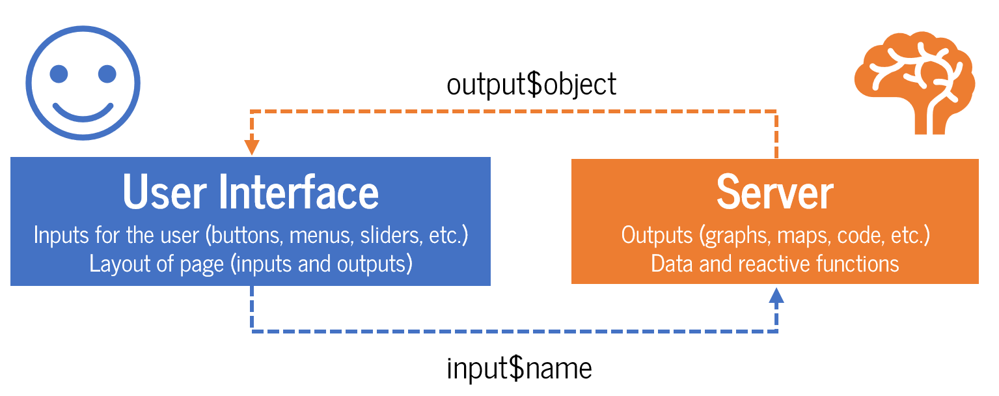
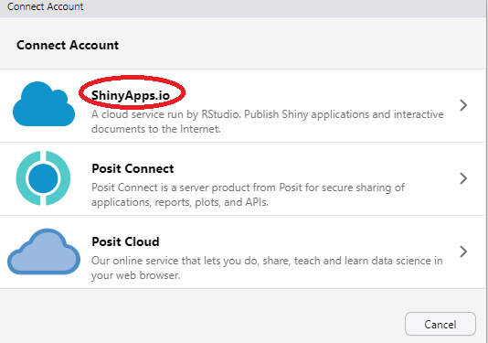
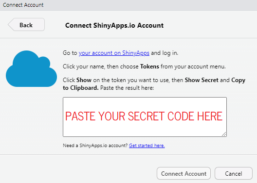

> "*The internet broke the private-public wall; impulsive and inelegant utterances that used to be kept private are now available for literal interpretation.*" <br>-- N. N. Taleb

One of the best things about working with R is publishing your work online. The possibilities are endless: blogs, books, articles, games, dashboards can all be published from R. You already know [Quarto](https://quarto.org/) is a great builder of HTML and interactive content.

In these final sessions you will learn how to build apps. Let's get started.

::: {.lesson-info}
**Level:** Advanced &nbsp;·&nbsp; **Time:** ~90 min &nbsp;·&nbsp; **Prerequisites:** Everything in its right place &nbsp;·&nbsp; **Tools:** shiny, bslib, shinyWidgets, plotly
:::

## You will learn to

- Structure a Shiny app around its two halves: the UI and the server.
- Build reactive inputs and outputs so the app updates itself as the user interacts with it.
- Theme an app with bslib and Bootswatch.
- Publish a Shiny app online and embed it in a Quarto page.
- Build a RevealJS presentation as a bonus output format.

## PART I: The real beauty of R

My favourite tool is Shiny for a simple reason --immediacy. Shiny allows full and immediate interactivity between inputs and outputs. It is very simple to build and quite flexible in [structure](https://rstudio.github.io/shinydashboard/structure.html), but in general every Shiny app has two parts: The **User Interface**, the face, and the **Server**, the brain. The user makes choices in the user interface over *inputs*, which are sent to the server to be calculated or reflected into *outputs*, which are then displayed in the user interface.

{width="800px" fig-align="center"}

Look at some great examples of Shiny at work:

-   [Spotify habits](https://nicohahn.shinyapps.io/spotify_habits/)
-   [Blog explorer](https://nz-stefan.shinyapps.io/blog-explorer/)
-   [Datify](https://kneijenhuijs.shinyapps.io/Datify)
-   [iSEE (interactive SummarizedExperiment Explorer)](https://kevinrue.shinyapps.io/isee-shiny-contest/)
-   [69 Love Songs: A Lyrical Analysis](https://committedtotape.shinyapps.io/sixtyninelovesongs/)

::: callout-tip
## Publish your apps online for free

Open a free [Shinyapps.io](https://www.shinyapps.io/) account to host your app online
:::

### 💔 Two apps on infidelity for the price of one

We'll build 2 apps on the same data using different options, just to showcase how versatile Shiny is. We'll use data from a survey carried out in 1969: 601 married adults were asked about infidelity --a difficult topic to inquire because people probably are not super honest about their responses.

#### App I 🎬: `page_sidebar`

The first app is simple, a bit boring. The **User Interface (UI)** for a shiny dashboard with a sidebar starts with `page_sidebar()` and includes a `sidebar()` where inputs usually go. In the sidebar we include a `selectInput()` function that will filter the data by self-declared level of happiness in the marriage by respondents. Also in the sidebar we include our first output: a reference plot with the levels of happiness of all respondents, that we call `plotOutput("happiness")`. We use a **Boostwatch** theme, just as you use for your blog.

::: column-margin

:::

The body of the app is defined directly with a [`card()`](https://rstudio.github.io/bslib/articles/cards.html) object, that boxes any element you include inside, and where we add our expected output: a `plotOutput()` object where our filtered graph will be displayed.

Let's build a very simple sidebar dashboard for some data on cheating. The app will show how many cheating "*incidents*" happened in the sample by gender and age, according to self-declared happiness.

```{r 6.shiny-sidebar}
#| eval: false
#| code-fold: true

# Packages needed
library(shiny)
library(RColorBrewer)
library(tidyverse)
library(bslib)

# Data #
affairs_1969 <- readr::read_csv("https://raw.githubusercontent.com/vincentarelbundock/Rdatasets/master/csv/AER/Affairs.csv") |> # <1>
  dplyr::mutate(happy = case_when(rating==1 ~ "very unhappy",  # <2>
                                  rating==2 ~ "somewhat unhappy", # <2>
                                  rating==3 ~ "average", # <2>
                                  rating==4 ~ "happier than average", # <2>
                                  rating==5 ~ "very happy")) # <2>
  dplyr::mutate(happy = fct_reorder(happy, rating), # <2> 
                cheat = factor(ifelse(affairs==0,"Faithful","Cheater")))  # <2> 
  


# Define simple  User Interface ####
ui_affair <- page_sidebar(
  # We start with the header with a title
  title = "Fair's Affairs 1969",
  # Color theme for the dashboard
  theme = bslib::bs_theme(
    bootswatch = "litera"
  ),
  # Now we define the sidebar
  sidebar = sidebar( # <3>
    width = 350,
      p("A survey with 601 respondents (315 female/286 male) on extra-marital affairs"), # <4>
      plotOutput("happiness", height = "150px"), # <5>
      # Selector
      selectInput(inputId = "happy", # <6> 
                  label = "Select self-evaluation of marriage:", # <6>
                  choices = unique(affairs_1969$happy), # <6>
                  selected = "average")  # <6>
        ),
  # Finally we define the body of the result
  plotOutput("affairs") # <7>
  )

# Define the server function inputs and outputs ####
server_affair <- function(input, output) { # <8>

  # Plot without selection
  output$happiness <- renderPlot({ # <9>
    
    affairs_1969 %>%
      dplyr::count(happy) |>
      ggplot(aes(y=happy,x=n,fill=happy))+
      geom_col()+
      geom_label(aes(label=n), fill="white",color="black",nudge_x = -10)+
      scale_fill_viridis_d(name = "turbo", direction=1)+
      labs(x=NULL, y=NULL)+
      theme_classic()+
      theme(legend.position = "none")
  })
  
  # Plot with selection
  output$affairs <- renderPlot({  # <10>
    
    affairs_1969 %>%
      dplyr::filter(happy==print(input$happy)) |> # <11>
      dplyr::group_by(gender,age) |>
      dplyr::count(cheat) |>
      ggplot(aes(x=age,y=n,fill=gender))+
      geom_col()+
      geom_label(aes(label=n), fill="black",color="white", vjust=-0.5)+
      ylim(c(0,80))+
      facet_grid(gender~cheat)+
      scale_fill_brewer(palette = "Set1")+
      scale_color_viridis_d()+
      theme_classic()+
      theme(text=element_text(size=18), legend.position = "none")+
      labs(title = "Respondents by self-declared happiness, by age and gender",
           subtitle = paste("Among", input$happy, "respondents"), # <12>
           x="Respondent age",
           y="# respondents")
  })
  
  }

# Run App ####
shinyApp(ui=ui_affair, server = server_affair)  # <12>
```

1.  We first download the data from the GitHub repository
2.  We code new variables: **happy** using the `case_when()` function, factoring using `fct_reorder()`, and **cheat** to count respondents who cheated and also factor.
3.  First part we define the `page_sidebar` structure
4.  We use `p()` to write Markdown text
5.  First output: `plotOutput`. We call it *happiness*
6.  We use a `selectInput` object to filter the data in the graph
7.  Another output as a `plotOutput` and call it *affairs*
8.  We define the server function, with inputs and outputs
9.  We fill the output slot we called *happiness* in the UI, using `renderPlot()` to produce the plot. This plot is independent of the `selectInput`
10. We fill the output slot we called *affairs*, again with `renderPlot()`. This plot is affected by decisions in the `selectInput`
11. Here is where the UI and server connect: the **input\$happy** filters the data in the graph and also changes the subtitle in `labs()`, as they are both affected by the `selectInput` choice.
12. We combine the UI and server objects we created in the `shinyApp()` function and watch the magic unfold

::: column-screen-inset-right
<iframe src="https://nelsonamayad-r4dev-fair-s-affairs-sidebar.share.connect.posit.cloud/" style="border: none; width: 100%; height: 650px" frameborder="0">

</iframe>
:::

#### App 2 🎬: `page_navbar`

The second app is fancier, has more elements, more interactivity, and better design principles.

First we start with a webpage layout --a navigation bar defined by `page_navbar` from the **`bslib`** package. We theme the app just as we did the blog using Bootswatch. We can define more element, like foreground and background colors of the colors of buttons.

The UI **ui_affair_alt** has a navigation bar at the top with two tabs: *"Happy cheaters?"* and *"Who cheated?"*. Each tab is defined using the `tabPanel()` function, and has a title, an icon from the **`font-awesome`** library, and [`card()`](https://rstudio.github.io/bslib/articles/cards.html) elements that holds the content of the tab. It also includes a `uiOutput` [`value_box()`](https://rstudio.github.io/bslib/articles/value-boxes.html) that can be clicked to see in full-screen mode. The content of the `value_box()` will be defined in the server. In the tabs, there are different input elements such as `selectInput` and `switchInput` from the [**`shinyWidgets`**](https://shinyapps.dreamrs.fr/shinyWidgets/) package, allowing the user to make selections and toggle switches to customise the displayed data.

Output elements include `girafeOutput`, for interactive plots, a `dataTableOutput` that produces interactive tables, and a simple pair of `plotOutput`.

The server function **server_affair_alt**, defines the logic and calculations for the Shiny app. The `renderGirafe` function generates interactive girafe plots based on the user's selection and filters the data accordingly using dplyr functions such as `filter()`, `group_by()`, and `count()`. Using `girafe` in Shiny gives us additional options using the **`opts_selected()`**, like clicking on parts of the graph that are then filtered into a table because girafe saves the selection in `input$outpuname_selected` for the variable defined in the `data_id`. The `renderDataTable` function creates a data table using the **`DT`** package, and filters the data based on the selected values from the `girafe`. This feature makes `girafe` one of the most powerful packages to work with in Shiny.

::: column-margin

:::

In the second tab we include 2 `renderPlot` that react to the user's button selection. There is a better way of approaching the problem of multiple inputs outputs that interact with one another called **reactivity**, which we will see in the next example.

For now let's see the code and the resulting app:

```{r 6.shinyapp-navbar}
#| eval: false
#| code-fold: true

# Packages needed ####
library(shiny)
library(shinydashboard)
library(RColorBrewer)
library(tidyverse)
library(bslib)
library(bsicons)
library(shinyWidgets)
library(ggiraph)
library(viridis)
library(DT)
library(fontawesome)
library(htmltools)

# Data ####
affairs_1969 <- readr::read_csv("https://raw.githubusercontent.com/vincentarelbundock/Rdatasets/master/csv/AER/Affairs.csv") |>
  dplyr::mutate(happy = case_when(rating==1 ~ "very unhappy",
                                  rating==2 ~ "somewhat unhappy",
                                  rating==3 ~ "average",
                                  rating==4 ~ "happier than average",
                                  rating==5 ~ "very happy")) |>
  dplyr::mutate(happy = fct_reorder(happy, rating)) |>
  dplyr::mutate(cheat=factor(ifelse(affairs==0,"Faithful","Cheater"))) 


# Define User Interface ####
{ui_affair_alt <- page_navbar(
    # Page options ####
    title = "Fair's Affairs 1969",
    footer = "R4DEV",
    theme = bslib::bs_theme(
      bootswatch = "united",
      bg = "white",
      fg = "purple",
      success = "red",
      danger = "orange",
      base_font = "News Cycle",
      font_scale = 1.1
    ),
    # First panel ####
    tabPanel(title = "Happy cheaters?",
             icon = icon("heart-crack", lib = "font-awesome"), 
             layout_column_wrap(
               width = 1/2,
               uiOutput("cheating_rate"),
               card(
                 card_header("Survey from 1969 in Psychology Today"),
                 card_body(
                   p("Was cheating more likely in unhappy marriages?"),
                   p("Were most educated couples more or less likely to have an unfaithful partner?"),
                   p("What about couples with children?")
                   )
                 )),
              layout_column_wrap(
                width=1/2,
                card(
                  full_screen = TRUE,
                  card_header(
                    selectInput(inputId = "happy",
                                label = "Select respondents by self-evaluation of marriage:",
                                choices = unique(affairs_1969$happy),
                                selected = "average")
                    ),
                  girafeOutput("affairs")
                  ),
                card(
                  full_screen = TRUE,
                  card_header("Respondents:"),
                  DT::dataTableOutput("table")
                  ))),
    # Second panel ####  
    tabPanel(title = "Who cheated?",
             icon = icon("triangle-exclamation", lib = "font-awesome"),
             layout_column_wrap(
               width=1/2,
               height = "150px",
               uiOutput("cheating_children"),
               card(
                 card_header("Who cheated more frequently?"),
                 card_body(
                   shinyWidgets::switchInput(
                     inputId = "children",
                     label = "Respondent has children?",
                     value = FALSE,
                     onLabel = "Yes",
                     offLabel = "No",
                     onStatus = "success",
                     offStatus = "danger")
                   ))),
                 layout_column_wrap(
                   width = 1/2,
                   card(
                     full_screen = TRUE,
                     card_header("By years of education"),
                     card_body(
                       plotOutput("affairs_edu")
                       )),
                   card(
                     full_screen = TRUE,
                     card_header("By years of marriage"),
                     card_body(
                       plotOutput("affairs_years")
                       )))))
}

# Define the server function ####
server_affair_alt <- function(input, output) {
  
  # First tab ####
  ## Cheating rate value box ####
  output$cheating_rate <- renderUI({
    
    value_box(
      title = "Cheating rate in the sample:",
      height = "200px",
      value = affairs_1969 |> 
        dplyr::count(cheat) |>
        dplyr::mutate(sample = sum(n)) |>
        dplyr::transmute(cheat_rate = scales::percent(n/sample)) |>
        dplyr::slice(1) |>
        as.character(),
      showcase = bsicons::bs_icon("heart-pulse-fill"), 
      p("Infidelity varies by age, occupation, children and years of marriage"),
      full_screen = TRUE,
      theme_color = "success"
    )
  })
  
  ## Plot ####
  output$affairs <- renderGirafe({
    
    affairs_gg <- affairs_1969 |>
      dplyr::filter(happy==input$happy) |> 
      dplyr::count(cheat,gender,age) |>
      ggplot(aes(x=age,
                 y=n,
                 fill=cheat,
                 data_id=age, 
                 tooltip=paste0("Type: ", cheat,
                                "<br>Respondents: ", n,
                                "<br>Age: ", age)))+
      ggiraph::geom_col_interactive()+
      theme_classic()+
      facet_wrap(gender~cheat)+
      scale_fill_viridis_d("plasma")+
      theme(legend.position = "none")+
      labs(title = "Respondents by self-declared happiness, by age and gender",
           subtitle = paste("Among", input$happy, "respondents"),
           x="Respondent age",
           y="# respondents")
    
    ggiraph::girafe(ggobj = affairs_gg,
                    opts_selection(type = "multiple"))
  })
  
  ## Table ####
  output$table <- DT::renderDataTable({
    
   affairs_1969 |>
      dplyr::filter(happy==input$happy) %>%
      dplyr::group_by(cheat,age) |>
      dplyr::mutate(n=n()) |>
      dplyr::filter(age %in% input$affairs_selected) |>
      dplyr::ungroup() |>
      dplyr::select(affairs, age, education,children, happy, n) 
  })
  
  # Second tab ####
  ## Value box ####
  output$cheating_children <- renderUI({
    
    value_box(
      title = "How many respondents who cheated had children?",
      height = "200px",
      value = affairs_1969 |>
        dplyr::filter(children=="yes") |>
        dplyr::count(cheat) |>
        dplyr::mutate(sample = sum(n)) |>
        dplyr::transmute(cheat_rate = scales::percent(n/sample)) |>
        dplyr::slice(1) |>
        as.character(),
      showcase = icon("children", lib = "font-awesome"), 
      p("Cheaters with children in the sample"),
      full_screen = TRUE,
      theme_color = "danger"
    )
  })
 
  ## Plot by education ####
  output$affairs_edu <- renderPlot({
    
    if (input$children) { 
      
      affairs_1969 %>%
        dplyr::filter(children=="yes") |>
        dplyr::count(cheat, gender, education) |>
        ggplot(aes(x=education,y=n,fill=cheat))+
        geom_col()+
        geom_label(aes(label=n), fill="black",color="white", vjust=-0.5)+
        scale_fill_brewer("Set2")+
        facet_wrap(gender~cheat)+
        theme_classic()+
        theme(legend.position = "none")+
        labs(title = paste("Among", input$happy, "respondents"),
             x="Respondent education",
             y="# respondents")
    }
    else { 
      affairs_1969 %>%
        dplyr::filter(children=="no") |>
        dplyr::count(cheat, gender, education) |>
        ggplot(aes(x=education,y=n,fill=cheat))+
        geom_col()+
        geom_label(aes(label=n), fill="black",color="white", vjust=-0.5)+
        facet_wrap(gender~cheat)+
        scale_fill_viridis_d("rocket")+
        theme_classic()+
        theme(legend.position = "none")+
        labs(title = paste("Among", input$happy, "respondents"),
             x="Respondent education",
             y="# respondents")
    }
  })
  
  ## Plot by years of marriage ####
  output$affairs_years <- renderPlot({
    
    if (input$children) { 
      
     affairs_1969 %>%
        dplyr::filter(children=="yes") |>
        dplyr::count(cheat, gender, yearsmarried) |>
        ggplot(aes(x=yearsmarried,y=n, fill=cheat))+
        geom_col()+
        geom_label(aes(label=n), fill="black",color="white", vjust=-0.5)+
        facet_wrap(gender~cheat)+
        scale_fill_brewer("Set2")+
        theme_classic()+
        theme(legend.position = "none")+
        labs(title = paste("Among", input$happy, "respondents"),
             x="Respondent years of marriage",
             y="# respondents")
      
    }
    else { 
        affairs_1969 %>%
          dplyr::filter(children=="no") |>
          dplyr::count(cheat, gender, yearsmarried) |>
          ggplot(aes(x=yearsmarried,y=n, fill=cheat))+
          geom_col()+
          geom_label(aes(label=n), fill="black",color="white", vjust=-0.5)+
          facet_wrap(gender~cheat)+
          scale_fill_viridis_d("rocket")+
          theme_classic()+
          theme(legend.position = "none")+
          labs(title = paste("Among", input$happy, "respondents"),
             x="Respondent years of marriage",
             y="# respondents")
      }
        
  })
  
}

# Run App ####
shinyApp(ui_affair_alt, server_affair_alt)
```

::: column-screen-inset-right
<iframe src="https://nelsonamayad-r4dev-fair-s-affairs-navbar.share.connect.posit.cloud/" style="border: none; width: 100%; height: 750px" frameborder="0">

</iframe>
:::

### Infidelity apps, side by side

Look at the two deployed apps side by side:

::: {#infidelity .column-screen-inset layout-ncol="2"}
```{=html}
<iframe src="https://nelsonamayad-r4dev-fair-s-affairs-sidebar.share.connect.posit.cloud/" style="border: none; width: 100%; height: 700px" frameborder="0">
</iframe>
```
```{=html}
<iframe src="https://nelsonamayad-r4dev-fair-s-affairs-navbar.share.connect.posit.cloud/" style="border: none; width: 100%; height: 700px" frameborder="0">
</iframe>
```
:::

### Deploying ShinyApps 🚀

When you create an App and run it from your computer, only you can access it. But if you want to make it public, you need to deploy it to your account, which will run the app on a server for anyone to see.

To deploy the app you need to register your Shinyapps.io account in RStudio following the steps below.

::: {#shinyapps layout-ncol="2"}
{width="100%"}

{width="100%"}
:::

::: callout-tip
## How do you embed a Shiny app in a website?

The app above is hosted in my Shinyapps.io account and running from the Shiny server there, but can be accessed directly in this site by using the **iframe** HTML.

To embed a deployed ShinyApp in your blog, just place the URL inside of an iframe src outside of a code chunk:

```         
<iframe src="YOUR SHINYAPP URL">
```
:::

## PART II: Shiny, in all its glory

Now let's build a proper Shiny app that brings together elements from previous sessions --data from an API, an interactive map and an interactive plot-- to watch the planet shake in near real time: every earthquake of magnitude 4.5 or more recorded in the last 30 days.

We'll look at each part of the app separately and then put them together.

### The Data 📊

The [US Geological Survey](https://earthquake.usgs.gov/earthquakes/feed/v1.0/geojson.php) publishes a free, keyless feed of recent earthquakes as **GeoJSON**, refreshed every few minutes. Each earthquake is a *point*: a magnitude, a place name, a time, and a pair of coordinates (plus depth). That's all we need to map it --no country borders or shapefiles to download.

We wrap the download in a function, `read_quakes()`, rather than running it once at the top of the script. That way the app can call it again whenever the user asks for fresh data.

```{r 7.shiny-quakes-data}
#| eval: false

library(dplyr)
library(purrr)
library(jsonlite)

read_quakes <- function(feed = "4.5_month") { # <1>
  raw <- jsonlite::fromJSON( # <2>
    paste0("https://earthquake.usgs.gov/earthquakes/feed/v1.0/summary/", feed, ".geojson")
  )
  coords <- raw$features$geometry$coordinates # <3>

  tibble::tibble(
    place    = raw$features$properties$place,
    mag      = raw$features$properties$mag,
    lon      = purrr::map_dbl(coords, 1), # <4>
    lat      = purrr::map_dbl(coords, 2),
    depth_km = purrr::map_dbl(coords, 3),
    time     = as.POSIXct(raw$features$properties$time / 1000, origin = "1970-01-01", tz = "UTC") # <5>
  ) |>
    dplyr::filter(!is.na(mag), !is.na(lon), !is.na(lat)) |>
    dplyr::arrange(dplyr::desc(time))
}

quakes <- read_quakes()
```

1. USGS publishes several feeds (`significant_week`, `2.5_day`, `all_hour`...). We default to magnitude 4.5+ over the past month: usually a few hundred rows, a comfortable size for an app.
2. `fromJSON()` reads straight from the URL and simplifies the nested GeoJSON into data frames and lists.
3. Coordinates come as a *list* with one `c(longitude, latitude, depth)` vector per earthquake.
4. `map_dbl(coords, 1)` pulls the first element out of every vector --a compact `purrr` trick you'll meet properly in [Do it well, do it fast](/sessions_workshop/09-parallel/09-parallel.qmd).
5. USGS stores time as milliseconds since 1 January 1970, so we divide by 1000 and convert to a date-time.

### The UI 🙂

We start with the `page_navbar` layout, which puts a horizontal bar at the top of the page. Inside, we give the app a title and define a theme using `bslib`. I've chosen a very psychedelic theme --not because I like it, but to show how much the look of a dashboard changes just by picking a particular Bootswatch template (in this case, quartz). Colour, fonts, buttons --all are parameters you can customise with `bslib`.

Then comes the `sidebar`, where we organise our **inputs**. There are three: a **button** to download fresh data, a **slider** for the minimum magnitude and a **date range**. We use a `card` to box in the button and a short description of the app, and an `accordion` to collapse the selectors. At the top of the card, a `value_box` (built on the server and placed here with `uiOutput`) summarises the strongest earthquake on screen.

Finally, two `nav_panel`s hold our two outputs: a map and a plot. Both are made with **plotly**, so both use `plotlyOutput()`. The IDs we give them here (`"map"`, `"mag_time"`) must match the names we fill in on the server.

```{r 7.shiny-quakes-ui}
#| eval: false

library(shiny)
library(bslib)
library(bsicons)
library(plotly)

ui <- page_navbar(
  theme = bslib::bs_theme(bootswatch = "quartz", primary = "#226F7F"), # <1>
  title = "Global Earthquakes",
  sidebar = sidebar(
    gap = "5px",
    width = 380,
    card(
      full_screen = TRUE,
      card_header(uiOutput("summary_box")), # <2>
      card_body(
        markdown("Earthquakes of magnitude 4.5+ over the last 30 days, from the [USGS real-time feed](https://earthquake.usgs.gov/earthquakes/feed/v1.0/geojson.php)."),
        actionButton("update", "Download fresh data", icon = icon("refresh"), class = "btn-primary") # <3>
      )
    ),
    accordion(
      open = TRUE,
      accordion_panel(
        "Selectors:",
        sliderInput("min_mag", "Minimum magnitude",
                    min = 4.5, max = 8, value = 5, step = 0.1), # <4>
        dateRangeInput("date_range", "Date range",
                       start = Sys.Date() - 30, end = Sys.Date(),
                       min = Sys.Date() - 30, max = Sys.Date())
      )
    )
  ),
  nav_panel(title = "Map", icon = bsicons::bs_icon("globe"), plotlyOutput("map", height = "100%")), # <5>
  nav_panel(title = "Magnitude over time", icon = bsicons::bs_icon("graph-up"), plotlyOutput("mag_time", height = "100%")),
  nav_item(input_dark_mode(id = "dark_mode", mode = "light")) # <6>
)
```

1. That truly ugly quartz Bootswatch theme, for pedagogical purposes, with the R4DEV teal as the primary colour.
2. A placeholder for UI that the server will build --here, a value box that changes with the data.
3. An `actionButton` does nothing on its own; it just counts clicks. The server decides what a click means.
4. Magnitude is logarithmic: an M6 shakes about ten times harder than an M5. Sliding from 4.5 to 6 hides the great majority of the points.
5. Each tab holds one output. The ID (`"map"`) is the contract between UI and server.
6. A light/dark switch, for free.

::: callout-tip
## Help! Is there an easier way to design user interfaces?

You can use the [shinyuieditor](https://rstudio.github.io/shinyuieditor/) package to design your UI elements and layout by dragging and dropping.

Start with the [live demo](https://rstudio.github.io/shinyuieditor/live-demo/)
:::

### The Server 🧠

Now we build the server function, where things get interesting for two reasons: **reactive functions** and **events**.

The server function has two main arguments: `input`, which connects the server to the inputs defined in the UI, and `output`, where we store whatever we compute from those inputs --a plot, a table, a map, you name it [^1].

[^1]: A third argument called `session` is often used, but we won't go into that here.

::: callout-note
## What's the point of reactivity in Shiny?

> [*"Reactive programming is a style of programming that focuses on values that change over time, and calculations and actions that depend on those values"*](https://mastering-shiny.org/reactive-motivation.html#motivation) --[@wickham_mastering_2020]

Put differently, reactive functions make it easier to link inputs and outputs by creating an intermediary object that changes with the inputs, so that every change flows through a single object. I know this sounds abstract now, but it will become clear soon.
:::

This app has three outputs (a value box, a map and a plot), but before we can render them we build two intermediary steps:

-   **Working with buttons**: downloading the feed takes a second or two, and we don't want to hit USGS every time someone nudges a slider. So we wrap the download in `eventReactive(input$update, ...)`: it runs only when the button is clicked. With `ignoreNULL = FALSE` it also runs once at start-up, so the app never opens empty.

-   **Our reactive function**: filtering a few hundred rows, on the other hand, is instant. So the filtering lives in a plain `reactive()`, which re-runs automatically whenever `input$min_mag` or `input$date_range` change. Every output reads this filtered data --called like a function, `quakes_shown()`-- and nothing else.

Notice the chain: **button → `quakes()` → `quakes_shown()` ← selectors**, and all three outputs hang off `quakes_shown()`. **Reactivity is not easy and takes practice**, but drawing that chain before you write any code is the best habit you can build, because apps get complex fast and it is easy to lose track of which inputs affect what.

The map itself is a plotly `scattergeo` trace: one marker per earthquake at its longitude/latitude, sized and coloured by magnitude, on a world basemap that plotly draws for us.

```{r 7.shiny-quakes-server}
#| eval: false
#| code-fold: true

server <- function(input, output, session) {

  quakes <- eventReactive(input$update, { # <1>
    read_quakes()
  }, ignoreNULL = FALSE)

  quakes_shown <- reactive({ # <2>
    quakes() |>
      dplyr::filter(mag >= input$min_mag,
                    as.Date(time) >= input$date_range[1],
                    as.Date(time) <= input$date_range[2])
  })

  output$summary_box <- renderUI({ # <3>
    d <- quakes_shown()
    value_box(
      title = "Strongest earthquake shown",
      value = if (nrow(d) > 0) paste0("M", round(max(d$mag), 1)) else "—",
      theme = "danger",
      showcase = bsicons::bs_icon("exclamation-triangle"),
      p(paste(nrow(d), "earthquakes in range"))
    )
  })

  output$map <- renderPlotly({ # <4>
    plot_ly(
      quakes_shown(),
      type = "scattergeo", mode = "markers",
      lon = ~lon, lat = ~lat,
      marker = list(
        size = ~4 + (mag - 4.5) * 5,
        color = ~mag, cmin = 4.5, cmax = 8,
        colorscale = list(c(0, "#F2C078"), c(0.5, "#F75431"), c(1, "#8C1D0E")),
        colorbar = list(title = "Magnitude"),
        opacity = 0.8, line = list(width = 0)
      ),
      text = ~paste0("M", mag, " — ", place,
                     "<br>", format(time, "%d %b %Y, %H:%M UTC"),
                     "<br>depth: ", round(depth_km), " km"),
      hoverinfo = "text"
    ) |>
      layout(
        geo = list(
          projection = list(type = "natural earth"), # <5>
          showland = TRUE, landcolor = "#D9D9D9",
          showocean = TRUE, oceancolor = "#EEF4F6",
          showcountries = TRUE, countrycolor = "white",
          bgcolor = "rgba(0,0,0,0)"
        ),
        paper_bgcolor = "rgba(0,0,0,0)",
        margin = list(l = 0, r = 0, t = 0, b = 0)
      )
  })

  output$mag_time <- renderPlotly({ # <6>
    plot_ly(
      quakes_shown(), x = ~time, y = ~mag,
      type = "scatter", mode = "markers",
      color = ~depth_km, colors = c("#0E8CA8", "#F75431"),
      text = ~paste0("M", mag, " — ", place, "<br>depth: ", round(depth_km), " km"),
      hoverinfo = "text"
    ) |>
      layout(
        xaxis = list(title = ""), yaxis = list(title = "Magnitude"),
        title = "Magnitude over time (colour = depth in km)"
      )
  })
}

shinyApp(ui, server) # <7>
```

1. The expensive step, tied to the button: each click re-downloads the feed.
2. The cheap step, tied to the selectors: re-filters instantly. Note that it *reads* `quakes()`, so a fresh download flows through it too.
3. `renderUI()` builds a piece of UI on the server --it fills the `uiOutput("summary_box")` slot.
4. `renderPlotly()` fills `plotlyOutput("map")`. The `~` formulas map columns of the data to aesthetics, much like `aes()` in ggplot2.
5. Try `"orthographic"` for a globe you can spin.
6. Same data, different view: time on the x-axis, colour by depth. Deep earthquakes cluster along subduction zones --hover to find them.
7. UI + server = app.

::: callout-important
## Why plotly and not leaflet?

You built leaflet maps in [Mapping despair in the USA](/sessions_workshop/05-maps/05-maps.qmd), and leaflet works beautifully *on your own machine*. But to deploy an app, the hosting server must install every package it uses, and their dependencies. `leaflet` depends on `sf`, which depends on `terra`, and in 2026 `terra` fails to compile on the servers of both shinyapps.io and Posit Connect Cloud (their geospatial system libraries are older than what `terra` expects). An app that runs locally but can't be deployed is a lesson in itself: **check your dependency chain before you build**. Plotly draws its own world basemap with no geospatial packages at all, so this app deploys anywhere.
:::

### The Full ShinyApp ✨

Here is the full app, deployed and embedded with an `<iframe>`. Click the button, slide the magnitude, switch tabs --and download the code to run it yourself.

::: column-margin

:::

```{=html}
<iframe src="https://nelsonamayad-r4dev-earthquakes.share.connect.posit.cloud/" style="border: none; width: 100%; height: 750px" frameborder="0" title="Global Earthquakes Shiny app">
</iframe>
```

Making an app quickly is easy, making a good app is not and requires a lot more tinkering to make sure the computations are efficient, and the UI is user-friendly, clear and useful. Otherwise it will be another app in a website nobody has any use for.

::: callout-tip
## Go nuts with Shiny extensions and improve the User Interface

Shiny has a large and expanding universe of extensions, [have a look](https://github.com/nanxstats/awesome-shiny-extensions)

A great source on improving the look of an app is [*Outstanding User Interfaces with Shiny*](https://unleash-shiny.rinterface.com/) [@granjon_outstanding_2020]
:::

## Bonus track: Interactive presentations

### [RevealJS](https://quarto.org/docs/presentations/revealjs/) presentations 🤩

Quarto produces other outputs beyond HTML, Word and PDF. One nice output includes RevealJS presentations, which are easy to do and display results computed in Quarto, so that you can include any object you're learned so far into a presentation directly.

To create a RevealJS presentation you only need to change the format to `format: revealjs` and become familiar with the structure of these presentations. RevealJS also has themes you can use, check them out [here](https://quarto.org/docs/presentations/revealjs/themes.html).

::: column-margin

:::

```{=html}
<iframe width="100%" height="500" src="revealjs.html" title="R4DEV as RevealJS"></iframe>
```
::: callout-tip
## Learn more about RevealJS presentations

Check out [this page](https://quarto.org/docs/presentations/revealjs/)
:::

## 🏗 Practice 7: Shine {.unnumbered}

A Shiny app needs a live R process, so all of this happens in your own R session -- start by running the session's apps, then build your own.

::: {.callout-note icon="false" collapse="true"}
# Basic

-   Run one of this session's apps locally with `shiny::runApp()`, change one input's label and default value, and re-run it
-   Add a new input (a slider or a selector) that filters the data behind one of the app's plots
:::

::: {.callout-important icon="false" collapse="true"}
# Intermediate

-   Replicate the UI and server design of the earthquakes app built above and make it your own: a different USGS feed (try `significant_month` or `2.5_week`), a new input (a depth slider?), or a third tab
-   Create a Shiny app that shows the frequency of use of all Eunoia words you scraped, by country. Use **`gtrendsR`** package to look up the frequency of each word by country.
-   Create a Shiny app for your project
:::

::: {.callout-caution icon="false" collapse="true"}
# Advanced

-   Deploy your apps to a free [shinyapps.io](https://www.shinyapps.io/) or [Posit Connect Cloud](https://connect.posit.cloud/) account, embed them into a new blog post with an `<iframe>`, and publish it
-   Create a RevealJS presentation with the best outputs in your blog
:::

## Key takeaways

- Every Shiny app has two halves: a UI that describes the layout, and a server that reacts to input and computes output.
- Reactivity means you describe *what* depends on *what* -- Shiny handles *when* to recompute it.
- bslib/Bootswatch theming works the same way in a Shiny app as it does in a Quarto site.
- A deployed app is embedded elsewhere with a plain `<iframe>`, the same way this lesson embeds its own examples.
- RevealJS presentations are a Quarto output format, not a Shiny feature -- useful any time you need slides from the same source as a report.

::: {.continue-learning}
[← Previous: Just take it](/sessions_workshop/06-scrap/06-scrap.qmd)

[Track overview: Build with R →](/learn/build-with-r.qmd)

[Next: Smart reports →](/sessions_workshop/08-reports/08-reports.qmd)
:::

## References

::: {#refs}
:::
