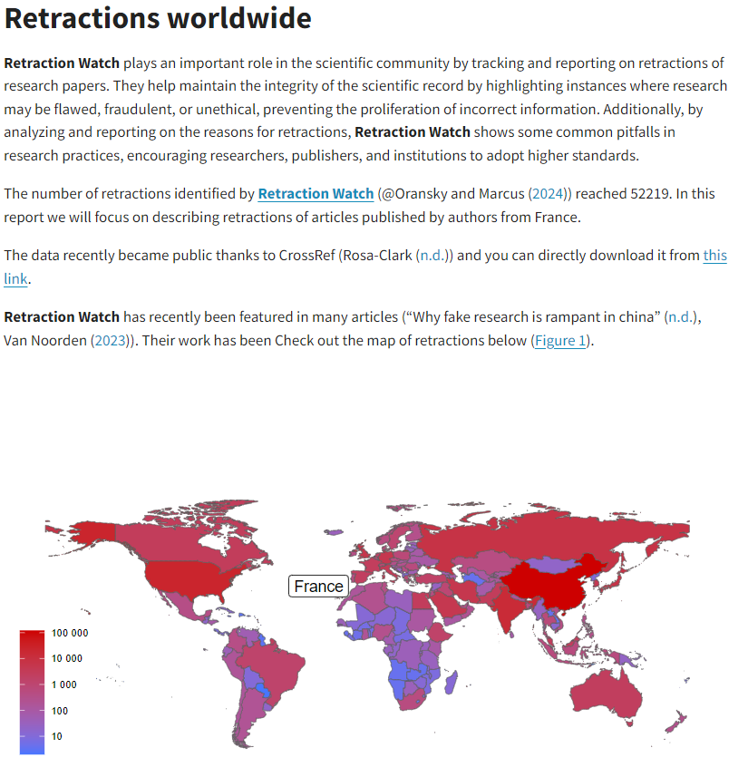
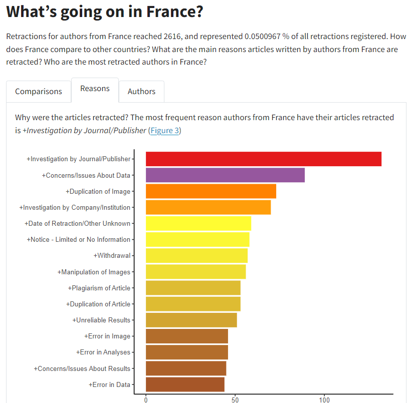

## [Zotero](https://www.zotero.org/), why oh why didn't I meet you before? 🤩

Academic and policy writing is in constant demand for seamless integration and management of bibliographic references that change during publication. Quarto supports **Zotero**, a powerful reference management software, to streamline the citation process.

Zotero stands out for its ability to collect, organise, and store bibliographic references from various sources, through a very easy interface. Zotero can easily capture relevant citation information with a single click, thanks to its browser extension. To begin, download and install [Zotero from its official website](https://www.zotero.org/), and to add the browser extension for easy data capture.

::: {.callout-tip appearance="simple"}
# [Zotero quick start guide](https://www.zotero.org/support/quick_start_guide)
:::

### Exporting references from Zotero

Before integrating with Quarto, you must export your Zotero library (or a specific collection within it) as a BibTeX file (`.bib`), which Quarto will use to manage citations within your documents. Follow these steps:

1.  Open Zotero and select the library or collection you wish to export.
2.  Go to **"File"** -\> **"Export Library"** and choose the BibTeX format.
3.  Save the `.bib` file to your project directory or a location accessible to your Quarto document

### Using `.bib.` in Quarto

You can add the bibliography you just exported from Zotero by including it in the YAML header of your document like this, assuming the file with the references was exported with the dull name `references.bib`:

```{r}
#| eval: false
bibliography: references.bib
```

### Citing

Citing is straightforward. Use the citation key assigned to your references in Zotero, and include them into your text using square brackets and the **`@`** symbol. For example, like this: [`@citationKey`]. If you're referencing a work by Thom Yorke from 2001, which has a citation key of yorke2001, you would write [`@yorke2001`] within your document where you wish to cite this source. The rest is automatically handled by Pandoc and Quarto, like magic.

::: {.callout-tip collapse="false"}
# Learn about citations and footnotes in Quarto

The reference page in Quarto on [citations and footnotes](https://quarto.org/docs/authoring/footnotes-and-citations.html#citations) is great, check it out.
:::

### References section and render

At the end of your document, include a Reference section and a {#refs} so the bibliography is automatically included and formatted there. When you render your Quarto document, the citations you've included will be automatically formatted according to the bibliography and citation style you've specified. Quarto supports numerous citation styles, and you can specify a particular style using the csl field in the YAML metadata, pointing to a `.csl` file corresponding to your desired citation format.

```{r}
#| eval: false
# References

::: {#refs}
:::
```

## Work smart, not hard: Parametrised reports with [*Retraction Watch*](https://retractionwatch.com/) data

🛠️ *Under construction* 🛠

Ever find yourself in a Groundhog Day of report writing, where every day feels like you're crafting the same report over and over, with a few small tweaks for different audiences? We have all been there.

::: column-margin

:::

There is a way out of the Sisyphean repetition: **parametrised reports**. No more copy-pasting or manual tweaking. Focus on a report template and then let Quarto do the hard work.

We will work with an exciting newly-released database: [**Retraction Watch**](https://retractionwatch.com/). They track scientific publications that have had to be retracted because of errors, fraud or other scientific misconduct [@oransky_retraction_2024, @the_economist_2024, @van_noorden_more_2023].

Before you continue with this section, download the files (`.zip`) needed by clicking the button below:



### Part 1: The template 📜
<br>
<br>
The **Retraction Watch** database is large, so we want to create a country-by-country report of the state of publication retractions. We could build a report for every country, but that would send us down the Groundhog Day path we want to avoid.

You already know how to build a Quarto blog, so we will focus on creating a `.qmd` template that we can reuse for any country, and then parse a list of countries to create as many reports as we want. We want a report that shows how many retractions there are by nationality of authors, and for each country, show why retractions happen and which authors have the most retractions.

The main trick are parameters in the YAML header: **params**, which stands for **parameters**. Here you can define a list of variables and possible values they can take throughout your document. The **params** object is accessed within the Quarto document through embedded code chunks, and can be used to filter the data, customise plots, among other things. For example, in the context of the **Retraction Watch** country report, we will use parameter named `country` to generate a country-specific analysis, such that each country report only include records from a selected country. You can see the expressions in the code below.

We can use as many parameters as we want, but to keep it simple, in this example we use only one.

#### Parameters in the YAML

First look at the YAML below. It has a `params` option that defines one variable, `country`, and used one value, in this case, France It also has within the description a quoted **r params\$country**, which embeds the country name in the upper part of the report.

```{r}
#| eval: false
title: "RetractionWatch"
subtitle: "Working hard to hardly work using Quarto parametrised reports"
description: "This report describes the state of scientific articles that have been retracted, focusing on researchers from `r params$country`"
author: "R4DEV"
date: last-modified
params: 
  country: "France"
bibliography: RetractionWatch.bib
csl: oecd.csl
link-citations: true
```

#### Using `params` in code chunks and in the body of the report

The document starts with a hidden chunk that calculates many values that will be used in the report, and these values, crucially, vary by country.

Consider for instance this part that counts the number of retractions by country and then saves the value for the country we are building the report on using **params\$country**:

```{r}
#| eval: false
retractions_country <- retractionwatch_df |>
      dplyr::count(country) |>
      dplyr::filter(country==params$country) |> 
      dplyr::select(n) |>
      as.integer()
```

Check out the entire report in detail so you see the different ways in which the parameter can be used. Below you can see the result of running the report for France.

::: {layout-ncol="2"}




A Retraction Watch report for France
:::

::: column-page
::: {.callout-note collapse="true"}
## Compare parametrised reports, side by side

Note that the only thing that changes in the report is the focus country. The data in the text is consistent.

::: {layout-ncol="2"}
### France 🇫🇷

```{=html}
<iframe src="https://r4dev-retraction-watch-france.netlify.app" style="border: none; width: 100%; height: 400px" frameborder="0">
</iframe>
```
### India 🇮🇳

```{=html}
<iframe src="https://r4dev-retraction-watch-india.netlify.app" style="border: none; width: 100%; height: 400px" frameborder="0">
</iframe>
```
:::
:::
:::

### Part 2: The robot 🤖
<br>
<br>
Now that we have a template report that works for any country, we create a function that renders the report for any country we want at will: the robot. We use the `quarto` library to make this easier.

First, we create the function `retractionwatch_report` which has only one argument: `country_input`. We then call the `quarto_render()` function and indicate the location of the parametrised report in the input option, name and time-stamp the output, choose which format we want to export the result (in this case, because of the interactive elements, we want HTML), and last but not least, we use the `execute_params` option to list all the parameters in the document, indicating that the variable `country` will take the value from the function.

```{r}
#| eval: false
# Create function to render the report####
retractionwatch_report <- function(country_input) {
  
  quarto::quarto_render(input = paste0(getwd(),"/retractionwatch_reports.qmd"),
                        output_file = paste0(lubridate::today(),"_retractionwatch_",country_input,".html"),
                        output_format = "html",
                        execute_params = list(country = country_input))
}

```

Now that we have out function, we test it with a new country name. This name will be replaced in the `params` YAML header and will therefore create a report for China:

```{r}
#| eval: false
# Test the function with a single country ####
retractionwatch_report(country_input = "China")
```

If the function works as intended, then we only need to provide a list of values for our parameter (i.e. countries), and the function will produce consistent reports for all countries we want. We use a `map()` function over a list of countries and just wait for the amazing result.

```{r}
#| eval: false
# Use a list of countries and map the function to get all reports ####
list("Colombia","Canada","France","Norway") |>
  purrr::map(retractionwatch_report)
```

## Bonus track: Report in multiple formats and other forms of magic

You can create reports in as many formats as Quarto renders, including Word, PowerPoint, RevealJS, PDF, etc. Just be sure to change the function so that the output matches the extension of the file.

You can also create parts of a report that only appear under [certain conditions](https://quarto.org/docs/authoring/conditional.html), which gives you amazing flexibility. For instance, if you have an interactive map that only works in HTML but you also want the report to be rendered as PDF, you can add the {.content-hidden} option in particular sections of the report.

```{r}
#| eval: false
::: {.content-hidden when-format="html"}

The content will be hidden when you render HTML output

:::
```

{width="150%"}

# References

::: {#refs}
:::
