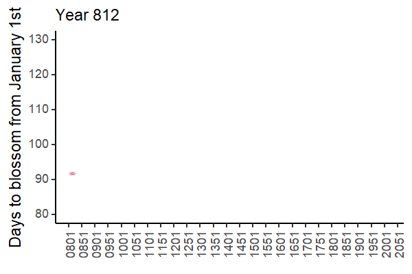

## Content

### Philosophy

### Skills

### Sessions

### Example: Sakura

### Example: A map

### Example: An interactive map

### Example: Shiny

## Philosophy

Never ever ever handle data in Excel


- Nobody *excels* using Excel...

- More fiction is written in Excel than in Word

## Skills

### 🧰 `Wrangle`

### 👀 `Visualise`

### 📖 `Analyse text`

###  📊 `Report`

###  🗺️ `Map`

### 🌐 `Fetch online data` 

### 💠 `Publish` 

## Sessions

:::: {.columns}
::: {.column width="50%"}
### [I. Quarto](https://nelsonamayad.github.io/R4DEV/sessions_workshop/01-quarto/01-quarto.html)
### [II. Visualisation](https://nelsonamayad.github.io/R4DEV/sessions_workshop/02-plots/02-plots.html)
### [III. Text](https://nelsonamayad.github.io/R4DEV/sessions_workshop/03-text/03-text.html)
### [IV. Animation](https://nelsonamayad.github.io/R4DEV/sessions_workshop/05-animate/05-animate.html)

:::

::: {.column width="50%"}
### [V. Mapping](https://nelsonamayad.github.io/R4DEV/sessions_workshop/06-maps/06-maps.html)
### [VI. Scraping](https://nelsonamayad.github.io/R4DEV/sessions_workshop/07-scrap/07-scrap.html)
### [VII. Interactivity](https://nelsonamayad.github.io/R4DEV/sessions_workshop/08-shiny/08-shiny.html)
### [r-sources](https://nelsonamayad.github.io/R4DEV/sessions_tools/02-resources/02-resources.html)
:::

::::

## Example: Sakura and a map of Japan

:::: {.columns}

::: {.column width="50%"}

:::

::: {.column width="50%"}
```{r}
library(rayshader)
library(tidyterra)
library(tidyverse)
library(ggthemes)

jpn <- geodata::elevation_30s("JPN", path=getwd())

ggplot()+
  geom_spatraster(data=jpn)+
  scale_fill_hypso_c(name=NULL)+
  ggtitle("Elevation map of Japan")+
  theme_map()+
  theme(panel.background = element_blank(),
        legend.position = "none")
```
:::

::::


## Example: A map

```{r}
#| echo: false
#| warning: false
#| error: false
#| fig-height: 5

library(sf)            #Simple object package
library(rnaturalearth) #Contains a sf world map
library(ggthemes)      #Gives us themes for maps
library(tidyverse)

rnaturalearth::ne_countries(returnclass = "sf") |>
  dplyr::filter(iso_a3!="ATA") |>
  ggplot()+
  geom_sf(aes(fill=as.integer(pop_est)/1e6, geometry=geometry), alpha=0.5)+
  scale_fill_distiller(palette = "PuBuGn", direction=1, name = "Population (millions)")+
  labs(title="A simple world population map",
       caption="Source: rnaturalearth")+
  theme_map()

``` 

## Example: An interactive map

```{r}
#| echo: false
#| warning: false
#| error: false

library(ggiraph)
library(sf)
library(tidyverse)
library(countrycode) 
library(ggthemes)
library(patchwork)
library(rnaturalearth)
library(viridis)
library(viridisLite)

# First build the pipe for ggplot ####
gdpp_gg <- readr::read_csv("https://raw.githubusercontent.com/owid/owid-datasets/master/datasets/Maddison%20Project%20Database%202020%20(Bolt%20and%20van%20Zanden%20(2020))/Maddison%20Project%20Database%202020%20(Bolt%20and%20van%20Zanden%20(2020)).csv") |>
  dplyr::select(country=1,year=2,gdppc=3) |>
  dplyr::filter(year==2018) |>
  dplyr::mutate(iso3c = countrycode::countrycode(sourcevar = country, origin = "country.name", destination = "iso3c")) |>
  dplyr::filter(!is.na(iso3c)) |>
  dplyr::left_join(rnaturalearth::ne_download(returnclass = "sf") |>
                      dplyr::select(ISO_A3_EH, geometry),
                    by=c("iso3c"="ISO_A3_EH")) |>
  ggplot()+
  geom_sf_interactive(aes(geometry=geometry, 
                          fill=gdppc, 
                          data_id = gdppc,
                          tooltip=paste0(country,
                                         "<br>GDP per capita: USD ", 
                                         gdppc |> round(digits=0) |> 
                                           format(big.mark=" "))))+
  scale_fill_viridis_c_interactive(
      trans = "log10",
      labels = scales::number_format(), 
      name = "GDP per capita 2018", 
      option = "mako")+
  theme_map()
                      
maddison_girafe <- ggiraph::girafe(
  ggobj = gdpp_gg +
          plot_annotation(
            title = 'Look, GDP per capita across the world in 2018',
            caption = 'Source: Own calculations based on Maddison Project and OWID'
            ),
  options = list(
    opts_toolbar(position = "top", pngname = "r4dev-gdppc"),
    opts_tooltip(opacity = 0.8, css = "background-color:#AC0909;color:white;padding:5px;border-radius:3px;"
),
    opts_hover(css = girafe_css(
      css = "fill:orange;stroke:gray;",
      text = "stroke:none; font-size: larger",
      line = "fill:none",
      area = "stroke-width:1px"
    ))
  ))

maddison_girafe

```

## Example: Shiny

```{=html}
<iframe id="earthquakes" src="https://nelsonamayad-r4dev-earthquakes.share.connect.posit.cloud/" style="border: none; width: 100%; height: 550px" frameborder="0" title="Global Earthquakes Shiny app">
</iframe>
```

## Thank you

{width=150%}
